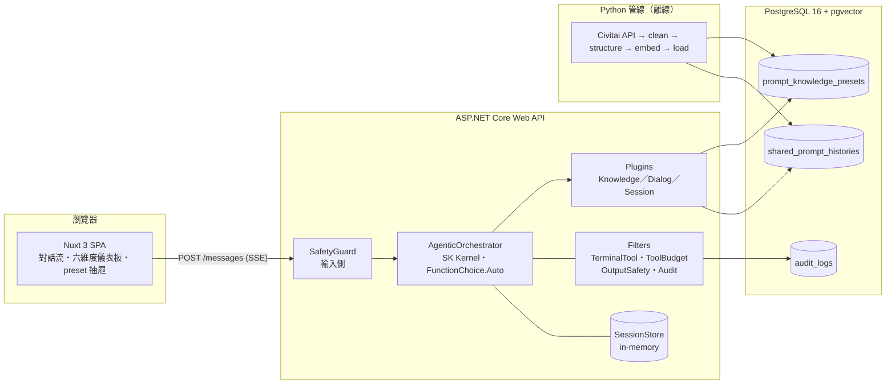

# GenAI Prompt Copilot

[](https://github.com/zhengjielin2018-web/GenAIPromptCopilot/actions/workflows/ci.yml)

用繁體中文描述想要的畫面，系統以六個維度判斷資訊夠不夠、主動追問缺的細節、從知識庫推薦可用片段，最後產出 SD／SDXL tag 風格的英文正／負向提示詞，逐個 tag 標示來源（知識庫片段、採用的組合或模型生成）。每次追問與定稿另外推薦知識庫裡真實存在、有圖的整套組合，使用者可逐項採用。求職作品集專案：每個技術點都有看得見的實證，功能深度其次。

<!-- 截圖待補（子專案 4 設計 §7.2 P7）：docs/images/chat.png（對話流＋六維度儀表板）、docs/images/final.png（定稿卡片）。檔案進版控後換回：


-->

## 架構



一輪對話：使用者送一句話 → 輸入側安全過濾 → 模型在動態組出的工具清單裡自己決定要查知識庫、更新儀表板、追問、討論還是定稿 → 每個工具呼叫即時以 SSE 推到前端 → 該輪以一個終止型工具收尾。任何一步失敗整輪回滾，跟資料庫交易一樣。細節見[主規格 §4](docs/superpowers/specs/2026-09-21-genai-prompt-copilot-design.md#4-核心編排全-agentic)；檢索與組裝的逐步拆解（以 Python 單輪 demo 實跑）見 [docs/單輪流程說明.md](docs/單輪流程說明.md)。

## 技術對照

| 技術 | 這個專案裡做了什麼 | 看哪裡 |
| :--- | :--- | :--- |
| Semantic Kernel | 全 agentic function calling；依 session 狀態動態組工具清單；`IAutoFunctionInvocationFilter` 做終止、預算、輸出安全、稽核四道 filter；兩層 RAG | `src/PromptCopilot.Api/Orchestration/`、`Plugins/`、`Filters/`；[主規格 §4](docs/superpowers/specs/2026-09-21-genai-prompt-copilot-design.md#4-核心編排全-agentic) |
| ASP.NET Core | SSE 串流（`Channel<AgentEvent>` → `IAsyncEnumerable`）；每輪 snapshot／rollback；session 鎖 | `Streaming/`、`Sessions/`、`Endpoints/`；[主規格 §10](docs/superpowers/specs/2026-09-21-genai-prompt-copilot-design.md#10-api-與-sse-協定) |
| PostgreSQL + pgvector | 分維度檢索：HNSW 先取近鄰、再套該維度的 facet 過濾，iterative scan 補足過濾後不足 k 筆的部分；候選池大小隨結果回報 | `db/init/001_schema.sql`、`Data/`；[檢索設計](docs/superpowers/specs/2026-09-22-dimension-scoped-retrieval-design.md) |
| Python | 分階段、可重跑的資料管線：抓取→清洗→Gemini 結構化→向量化→載入；分層抓取解題材偏斜 | `scripts/`；[語料擴增設計](docs/superpowers/specs/2026-09-22-corpus-expansion-design.md) |
| Nuxt 3 | 純函式 reducer 消費 SSE；tool call 卡片與儀表板即時變燈；整頁重載恢復 | `src/PromptCopilot.Frontend/`；[前端設計](docs/superpowers/specs/2026-09-24-frontend-sse-design.md) |
| 安全合規 | 輸入側 denylist + 分類器；輸出側對定稿、討論、追問的文字與選項全檢；資料側 NSFW 過濾。測試用的關閉開關預設不開放（`SAFETY_ALLOW_DISABLE`） | `Safety/`、`Filters/OutputSafetyFilter.cs`、`scripts/pipeline/nsfw_filter.py` |

## 一鍵跑起來

需要 Docker Desktop 與一把 [Gemini API key](https://aistudio.google.com/apikey)。

```bash
cp .env.example .env        # 填 GEMINI_API_KEY；POSTGRES_PASSWORD 隨意改
docker compose up
```

首次啟動會下載約 100 MB 的知識庫種子灌進資料庫（見下方「資料來源」），之後：

- 前端 <http://localhost:8080>
- Swagger <http://localhost:5000/swagger>

不想灌種子、要自己跑管線：`.env` 加一行 `SEED_URL=`（空字串），再照 [scripts/README.md](scripts/README.md)。

- 沒填 `GEMINI_API_KEY`：整套照樣起來，但每一輪對話都會失敗（`docker compose logs api` 開頭有一行警告）。填好後 `docker compose up -d api` 重建 api 容器即可。
- 重置知識庫：`docker compose down -v` 刪掉資料庫 volume，下次 `up` 重新建表並灌種子。

## 本機開發

| 想做什麼 | 看哪裡 |
| :--- | :--- |
| 起 API、在終端機逐輪對話 | [manual-tests/README.md](manual-tests/README.md) |
| 跑前端 dev server | [src/PromptCopilot.Frontend/README.md](src/PromptCopilot.Frontend/README.md) |
| 跑資料管線、匯出種子 | [scripts/README.md](scripts/README.md) |
| 人工 eval 案例與歷次結果 | [docs/eval-cases.md](docs/eval-cases.md) |

測試：`cd src && dotnet test`、`cd src/PromptCopilot.Frontend && npm test`、`cd scripts && pytest && ruff check .`。整合測試需要 `PC_INTEGRATION=1` 與本機資料庫，CI 不跑。

## 資料來源與免責聲明

知識庫種子是 [Civitai 公開 API](https://civitai.com) 與 [Kisegaeningyou](https://github.com/hayde0096/Kisegaeningyou) 的**衍生物**：原始提示詞經 Gemini 重新詮釋為繁中描述與結構化片段，不是逐字轉載。**圖片一律不轉存**，只保留指向上游的 URL，由瀏覽器向上游請求；產品內顯示圖片時一併顯示出處連結。Kisegaeningyou 上游未標示授權，本專案以署名與非商業用途為據收錄。本專案為非商業求職作品集，來源方或權利人提出要求即移除對應資料並重發種子。

完整說明、匯入細節與已知取捨：[docs/資料來源.md](docs/資料來源.md)。

## 文件

- [主規格](docs/superpowers/specs/2026-09-21-genai-prompt-copilot-design.md)：目標、架構、編排、facet 體系、安全、資料模型、API 協定、測試策略
- 子專案設計：[語料擴增](docs/superpowers/specs/2026-09-22-corpus-expansion-design.md)、[分維度檢索](docs/superpowers/specs/2026-09-22-dimension-scoped-retrieval-design.md)、[多輪對話](docs/superpowers/specs/2026-09-22-multi-turn-dialogue-design.md)、[批次 SearchPresets](docs/superpowers/specs/2026-09-24-batch-search-presets-design.md)、[前端與 SSE](docs/superpowers/specs/2026-09-24-frontend-sse-design.md)、[收尾與展示](docs/superpowers/specs/2026-09-24-subproject-4-packaging-design.md)、[知識庫開關與檢索細節](docs/superpowers/specs/2026-09-25-retrieval-switch-and-trace-design.md)、[整套組合推薦](docs/superpowers/specs/2026-09-25-set-recommendations-design.md)
- [單輪流程說明](docs/單輪流程說明.md)、[eval 案例](docs/eval-cases.md)、[資料來源](docs/資料來源.md)、[初步想法](docs/初步想法.md)
- [已知問題與待修清單](docs/known-issues.md)

## 授權

程式碼與文件採 [MIT](LICENSE)。知識庫種子（GitHub Release 資產）**不在** MIT 範圍內，其狀態見上一節。
