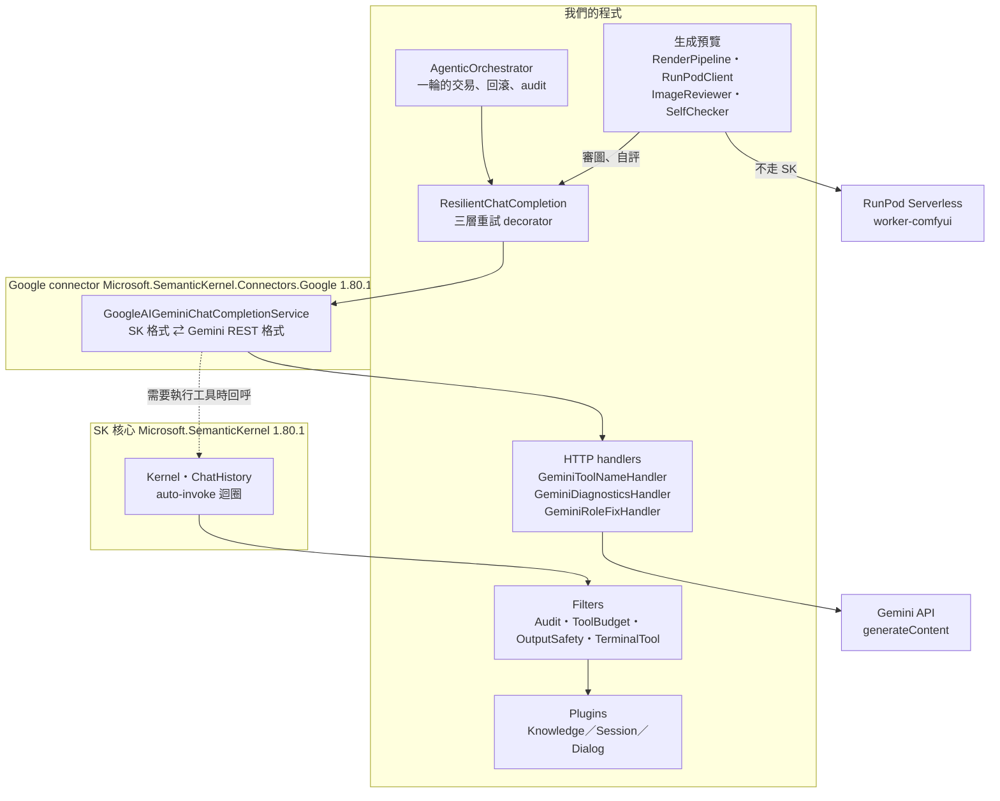
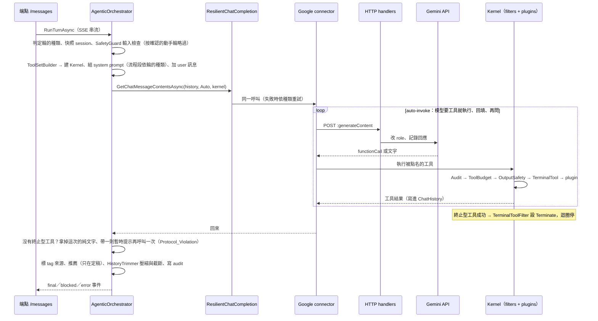

# Semantic Kernel 架構說明：我們的程式怎麼接上 SK 與 Gemini

日期：2026-09-29（2026-10-05 更新：先確認再動手的兩種輪、未宣告工具名的行為）
對象：看得懂 C#、但沒用過 Semantic Kernel（SK）的人。讀完應該知道：哪些程式是我們寫的、哪些是框架的；一輪對話在 SK 裡怎麼跑；升級 SK 或 connector 時要檢查什麼。
設計理由與取捨不在這裡重講，見[主規格 §4](superpowers/specs/2026-09-21-genai-prompt-copilot-design.md#4-核心編排全-agentic)。

> **維護規則：** 動到 `Program.cs` 的 LLM 註冊、`AgentKernelFactory`、`Llm/` 底下的 handler 或 decorator、filter 的掛法，
> 或升級 `Microsoft.SemanticKernel*` 套件時，這份文件在同一個 commit 裡一起更新。

---

## 1. 四層：誰寫的、做什麼



| 層 | 誰寫的 | 在這個專案裡的角色 |
| :--- | :--- | :--- |
| 我們的程式 | 我們 | 決定這一輪給模型哪些工具、工具做什麼、結果怎麼記、失敗怎麼回滾 |
| SK 核心 | Microsoft | 提供通用的抽象：`Kernel`、`ChatHistory`、`KernelFunction`、`IChatCompletionService`、filter 介面，以及「模型要求呼叫工具 → 執行 → 把結果塞回去再問一次」的 auto-invoke 迴圈 |
| Google connector | Microsoft（SK 團隊） | 實作 `IChatCompletionService`：把 `ChatHistory` 與工具宣告翻成 Gemini 的 REST 請求，把回應翻回 SK 的物件。`-alpha` 代表預覽版，行為不保證穩定 |
| Gemini API | Google | 真正的模型，有自己的請求格式規定（例如 role 只收 `user`／`model`） |

SK 的設計是「核心只定義通用格式，每家模型各有一個 connector 負責翻譯」。理論上換模型只要換 connector；實際上 Google connector 有自己的格式與怪癖（第 5 節），我們有幾處程式是在替它補洞。

套件定義在 [`PromptCopilot.Api.csproj`](../src/PromptCopilot.Api/PromptCopilot.Api.csproj)：

```xml
<PackageReference Include="Microsoft.SemanticKernel" Version="1.80.1" />
<PackageReference Include="Microsoft.SemanticKernel.Connectors.Google" Version="1.80.1-alpha" />
```

**Embedding 沒有走 SK。** [`GeminiEmbeddingClient`](../src/PromptCopilot.Api/Llm/GeminiEmbeddingClient.cs) 直接用 `HttpClient` 打 Gemini 的 `batchEmbedContents`，實作我們自己的 `IEmbeddingClient`。SK 只用在對話這一條路。

**生圖也沒有走 SK。** 定稿後生成預覽（[設計](superpowers/specs/2026-10-09-render-preview-design.md)）由背景服務 [`RenderPipeline`](../src/PromptCopilot.Api/Rendering/RenderPipeline.cs) 用 [`RunPodClient`](../src/PromptCopilot.Api/Rendering/RunPodClient.cs) 直接打 RunPod 的 REST（`/run`、`/status`、`/cancel`），不經過對話輪、不進 kernel。取回圖之後的看圖審查（[`ImageReviewer`](../src/PromptCopilot.Api/Safety/ImageReviewer.cs)）與自評（[`SelfChecker`](../src/PromptCopilot.Api/Rendering/SelfChecker.cs)）跟 `SafetyClassifier` 一樣，直接呼叫同一個 `IChatCompletionService`（不帶 kernel、`ResponseSchema` 要 JSON）。

**圖片怎麼給 Gemini：** 放在一則 user 訊息的 `ImageContent`（[`ImageForGemini`](../src/PromptCopilot.Api/Rendering/ImageForGemini.cs) 縮成長邊 768 的 JPEG，`image/jpeg`；用 SkiaSharp，縮不了就退回原本的 PNG），旁邊一個 `TextContent` 放指示；Google connector 把它轉成 Gemini 的 `inlineData`。這點由 `GeminiImageRequestTests` 用真的 connector 釘住（假的 HTTP handler 接住請求本文，不打網路）。圖片**不進主對話的 `ChatHistory`**：之後每一輪都要重送、token 一直漲，而且工具結果帶圖的寫法 connector 這一版還沒確認支援（[ComfyUI 整合可行性](ComfyUI整合可行性.md) §4）。

---

## 2. SK 概念對照：它在我們程式的哪裡

| SK 概念 | 是什麼 | 我們的程式 |
| :--- | :--- | :--- |
| `IChatCompletionService` | 「給一段對話歷史，回模型的回應」的介面 | 註冊在 [`Program.cs`](../src/PromptCopilot.Api/Program.cs)：`ResilientChatCompletion` 包著 `GoogleAIGeminiChatCompletionService`，整個 app 共用一個單例 |
| `ChatHistory` | 對話歷史（system／user／assistant／tool 訊息的清單） | 每個 session 一份，存在 [`Session.ChatHistory`](../src/PromptCopilot.Api/Sessions/Session.cs)；SK 跑工具時會直接往裡面追加訊息 |
| `Kernel` | 一個容器：裝著可用的工具（plugins）、filters、服務 | [`AgentKernelFactory.Create`](../src/PromptCopilot.Api/Orchestration/AgentKernelFactory.cs) **每輪新建一個**，因為每輪可用的工具不同 |
| Plugin／`[KernelFunction]` | 一個類別裡標了 `[KernelFunction]` 的方法 = 模型可以呼叫的工具 | [`Plugins/`](../src/PromptCopilot.Api/Plugins/)：`KnowledgePlugin`（`SearchPresets`、`SearchSimilarPrompts`）、`SessionPlugin`（`SetProfile`、`SetFacetStates`）、`DialogPlugin`（`Confirm`、`AskUser`、`Discuss`、`FinalizePrompt`、`RequestSaveConsent`） |
| `FunctionChoiceBehavior.Auto()` | 把 kernel 裡的工具宣告給模型，模型要呼叫時由 SK 自動執行並回填結果 | [`AgenticOrchestrator.CallAsync`](../src/PromptCopilot.Api/Orchestration/AgenticOrchestrator.cs) 的 `GeminiPromptExecutionSettings` |
| `IAutoFunctionInvocationFilter` | 包在每一次自動工具呼叫外面的 middleware，可以擋、改結果、叫迴圈停下 | [`Filters/`](../src/PromptCopilot.Api/Filters/) 四個，順序見第 3 節 |
| `PromptExecutionSettings` | 單次呼叫的參數 | 主迴圈用 `GeminiPromptExecutionSettings`（Auto 工具）；[`SafetyClassifier`](../src/PromptCopilot.Api/Safety/SafetyClassifier.cs) 另外用 `ResponseMimeType = "application/json"`、不帶 kernel（不給工具） |

**我們刻意沒用的 SK 功能：** 串流（`GetStreamingChatMessageContentsAsync`，`ResilientChatCompletion` 直接丟 `NotSupportedException`，因為終止型工具的參數要一次到位）；SK 的 embedding 抽象；SK 的 prompt template（system prompt 由 [`SystemPromptBuilder`](../src/PromptCopilot.Api/Orchestration/SystemPromptBuilder.cs) 自己組）；Agent Framework。

**「工具清單」怎麼控制：** 模型能看到的工具由 [`ToolSetBuilder.Build`](../src/PromptCopilot.Api/Orchestration/ToolSetBuilder.cs) 依這一輪的種類與 session 狀態決定，`AgentKernelFactory.AddFiltered` 只把清單內的函式註冊進 kernel。不該用的工具根本不在模型眼前，不靠 prompt 叫它不要用。

- **輪的種類（2026-10-05）：**使用者打字是確認輪，只有 `Confirm`、`Discuss`、檢索，沒有任何會改畫面的工具；還沒判定題材的那一輪（使用者第一句話）連檢索都沒有，兩個檢索工具沒有題材只會回「請先呼叫 SetProfile」。按下確認卡或採用是動手輪，才有 `SetProfile`、`SetFacetStates`、`AskUser`、`FinalizePrompt`，沒有 `Confirm` 與 `Discuss`。見[先確認再動手設計](superpowers/specs/2026-10-05-confirm-before-act-design.md) §3.1。
- **session 狀態：**追問額度用完就沒有 `AskUser`、知識庫關掉就沒有檢索工具⋯⋯

kernel 宣告給 Gemini 的工具名是 `<Plugin>_<Function>`（`Dialog_Confirm`、`Session_SetProfile`），不是 `[KernelFunction]` 上的短名。模型偶爾只寫短名，`GeminiToolNameHandler` 在回應進 connector 之前改回全名（第 5 節）。

---

## 3. 一輪對話在 SK 裡怎麼跑



幾個要點：

- **一次 `GetChatMessageContentsAsync` 裡面可能有好幾趟 HTTP 往返。** auto-invoke 迴圈在 connector 內部跑：模型要求呼叫工具 → connector 回呼 kernel 執行 → 結果加進 `ChatHistory` → 再送一次請求，直到模型回純文字或 filter 叫停。所以 [`ResilientChatCompletion`](../src/PromptCopilot.Api/Llm/ResilientChatCompletion.cs) 的重試是「續跑」：已完成的工具呼叫都還在 history 裡，重試會接著跑。
- **filter 的順序就是加進 kernel 的順序**，先加的在最外層：`AuditFilter`（記每一次工具呼叫）→ `ToolBudgetFilter`（每輪工具呼叫上限，用完就強制收尾：動手輪強制定稿、確認輪強制確認）→ `OutputSafetyFilter`（會把文字送到使用者眼前的工具先過審查）→ `TerminalToolFilter`（終止型工具成功後設 `context.Terminate = true`，讓迴圈停下）。
- **一輪就是一個交易。** plugin 直接改 `Session`（facet 狀態、ledger），任何一步失敗，orchestrator 用開頭的快照 `session.Restore(snapshot)` 整輪回滾。
- **plugin 怎麼拿到這一輪的狀態：** 每輪建 kernel 時把 [`TurnContext`](../src/PromptCopilot.Api/Orchestration/TurnContext.cs) 放進 `kernel.Data`，plugin 建構時也直接拿到它；filter 透過 `context.Kernel.Turn()` 取用。SSE 事件也是 plugin 透過 `TurnContext` 裡的 channel writer 即時推出去的。
- **輸入與輸出分類器也走同一個 `IChatCompletionService`**，只是不帶 kernel，所以它們的呼叫一樣會經過重試與 HTTP handlers，也算進每輪 log 的 `gemini=` 次數。

---

## 4. 我們在 SK 外面包的三層

SK 與 connector 沒有提供、但這個專案需要的東西，都用「包一層」的方式加上去，不改框架本身：

| 包在哪一層 | 元件 | 為什麼需要 |
| :--- | :--- | :--- |
| `IChatCompletionService` 外面（decorator） | [`ResilientChatCompletion`](../src/PromptCopilot.Api/Llm/ResilientChatCompletion.cs) | 把失敗分成四種（連線、內容攔截、回應不可用、致命）分別重試或放棄，分類在 [`LlmFailures.cs`](../src/PromptCopilot.Api/Llm/LlmFailures.cs)。connector 本身不重試 |
| connector 用的 `HttpClient` 裡（`DelegatingHandler`） | [`GeminiRoleFixHandler`](../src/PromptCopilot.Api/Llm/GeminiRoleFixHandler.cs) | 送出前改請求：把 connector 標錯的 role 改掉（第 5 節） |
| 同上 | [`GeminiDiagnosticsHandler`](../src/PromptCopilot.Api/Llm/GeminiDiagnosticsHandler.cs) | 讀原始回應：記攔截種類、`safetyRatings`、非 2xx 的錯誤本文，每次呼叫寫一行 log。connector 的例外把這些都丟了（known-issues #7） |
| 同上（最外層） | [`GeminiToolNameHandler`](../src/PromptCopilot.Api/Llm/GeminiToolNameHandler.cs) | connector 解析回應之前改工具名：模型寫成短名的呼叫改回宣告的全名；改不回來的同一輪第 2 次就中止（第 5 節，known-issues #13） |
| kernel 的 auto-invoke filter | [`Filters/`](../src/PromptCopilot.Api/Filters/) 四個 | 審計、預算、輸出審查、終止判斷 |

`HttpClient` 在 [`Program.cs`](../src/PromptCopilot.Api/Program.cs) 自己建，才能插 handler：

```csharp
var http = new HttpClient(new GeminiToolNameHandler(
    new GeminiDiagnosticsHandler(new GeminiRoleFixHandler(new HttpClientHandler()), logger), nameLogger));
new GoogleAIGeminiChatCompletionService(model, apiKey, GoogleAIVersion.V1_Beta, http)
```

`Llm:Provider` 組態目前只有 `Gemini` 一種有接；主規格 §4.8 預留的 OpenAI 路線沒有實作。

---

## 5. Google connector 的怪癖與我們的補丁

以下都是 `Connectors.Google` **1.80.1-alpha** 的行為，不是 SK 核心、也不是 Gemini 的規定（Gemini 的規定另外標出）。升級 connector 時，這張表逐條重新確認。

| 怪癖 | 誰的規定衝突 | 我們的處理 | 守門的測試 | 可以拿掉的條件 |
| :--- | :--- | :--- | :--- | :--- |
| 工具結果那則訊息送出時標成 `"role":"function"` | Gemini 只收 `user`／`model`，回 400 | `GeminiRoleFixHandler` 送出前改成 `user` | `GeminiRoleFixHandlerTests`；`HistoryTrimmerGeminiTests` 檢查送出的 role | connector 不再送 `function` role |
| 被擋時只丟 `KernelException("Prompt was blocked due to Gemini API safety reasons.")`，400 只留狀態碼 | — | `GeminiDiagnosticsHandler` 在 HTTP 層讀本文 | `GeminiDiagnosticsHandlerTests` | connector 的例外帶出 `promptFeedback`／`safetyRatings`／錯誤本文 |
| 工具結果放在 `GeminiChatMessageContent.CalledToolResults`，`Items` 只有一個空的 `TextContent`；放通用的 `FunctionResultContent` 會丟 `NotSupportedException` | — | `HistoryTrimmer.CompressTurn` 對 Gemini 訊息整則重建（known-issues #8） | `HistoryTrimmerGeminiTests` 釘住這個形狀 | connector 改用通用的 `FunctionResultContent` |
| 多個工具結果的 `GeminiChatMessageContent` 建構子是 internal | Gemini 要求一則回應裡的 `functionResponse` 數與呼叫數一致，不能拆開 | `HistoryTrimmer` 用反射呼叫；找不到就不壓縮，不會失敗 | `HistoryTrimmerGeminiTests` 的平行呼叫案例 | 建構子公開，或上一條解決 |
| 模型發出的工具呼叫送回時讀 `ToolCalls`，改 `FunctionCallContent.Arguments` 沒有作用 | — | 尚未處理：`AskUser`／`Discuss` 選項的 tag 剝除在 Gemini 上沒生效（known-issues #11） | — | — |
| auto-invoke 遇到沒宣告的工具名（模型寫短名 `Confirm`，宣告的是 `Dialog_Confirm`），只回模型一句「Error: Function call request for a function that wasn't defined.」就繼續迴圈；這條路徑不經過任何 filter，一次呼叫最多跑 128 趟 | — | `GeminiToolNameHandler`：唯一對得上的短名改成全名，照常進 plugin 與 filter；改不回來的記進這一輪，第 2 次丟 `UndeclaredToolCallException`，orchestrator 當成沒有結果、走補提示重試 | `GeminiToolNameHandlerTests`；`AgenticOrchestratorGeminiTests` 的短名、未宣告、卡住三個案例 | connector 讓未宣告的呼叫也經過 filter，而且模型不再寫短名 |
| `ChatHistory` 裡**任何位置**的 system 訊息都被併進 `systemInstruction.parts`，不留在 `contents`；只要還在 history，之後每一輪都會送 | — | orchestrator 的暫時提示（純文字補救、強制收尾）由 `CallWithReminderAsync` 帶，呼叫完就從 history 拿掉同一則。不改成 user 訊息：`HistoryTrimmer.Truncate` 以 user 訊息數輪次（known-issues #3） | `AgenticOrchestratorGeminiTests` 釘住這個形狀 | 不是補丁、不用拿掉；connector 改成保留 system 的位置時，重看補救與強制收尾 |

**沒宣告的工具名（表格倒數第二列，2026-10-05，known-issues #13）：**這段在 connector 的 `GeminiChatCompletionClient`，不在 SK 核心。`FunctionChoiceBehavior.Auto()` 轉成 `EnabledFunctions(autoInvoke: true)`，名字對不上宣告（不分大小寫）就只回一句錯誤文字，`ToolBudgetFilter` 數不到、`TerminalToolFilter` 停不下來，上限是 `DefaultMaximumAutoInvokeAttempts = 128`。模型多半原封不動重送，實際上先撞到整輪 120 秒逾時。修正前離線重現：模型卡在同一個沒宣告的呼叫上，一輪打了 258 次 Gemini（兩次 SK 呼叫各 129 次）；修正後 3 次就以 `protocol_violation` 收掉。改名能成立，是因為 Gemini 3 只驗 `thoughtSignature` 有沒有帶、不綁函式名稱（下面第二點）。流程段與補救、強制收尾的提示仍寫完整名稱，`system.md` 的 `{{TOOLS}}` 仍是短名；兩種寫法現在都會落到同一個工具。

另外三條屬於 Gemini 本身的行為，connector 換版也不會變：

- `promptFeedback.blockReason = PROHIBITED_CONTENT` 不屬於 `safetySettings` 可調門檻的類別，調門檻擋不掉（known-issues #4 的實測）。
- Gemini 3 系列要求工具呼叫帶回 `thoughtSignature`；handler 與 `HistoryTrimmer` 都原封不動保留它。只驗有沒有帶，不綁函式名稱：把呼叫改名後連簽章送回是 200，拿掉簽章是 400「Function call is missing a thought_signature」（2026-10-05 實打 `gemini-3.5-flash-lite`）。
- `contents` 以 model 結尾的請求回 `400 INVALID_ARGUMENT`「Requests ending with a model turn are not supported.」，有沒有帶 tools 都一樣（2026-09-29 實打 `gemini-3.5-flash-lite`）。加上表格最後一列，history 以純文字的 model 訊息結尾時補一則 system 提示，送出去仍以 model 結尾——這就是 known-issues #3。orchestrator 補救前先把那則純文字拿出 history。

---

## 6. 升級 SK 或 connector 時的檢查清單

1. 看 release notes 有沒有提到 Gemini 的 role、`FunctionResultContent`、`GeminiChatMessageContent`、例外訊息格式。
2. `dotnet test src/PromptCopilot.sln`：`GeminiRoleFixHandlerTests`、`GeminiDiagnosticsHandlerTests`、`GeminiToolNameHandlerTests`、`HistoryTrimmerGeminiTests`、`AgenticOrchestratorGeminiTests`、`GeminiImageRequestTests`（圖片轉 `inlineData`）是專門盯 connector 行為的，紅了就回第 5 節那張表逐條確認。
3. `LlmFailureClassifier.ContentBlockMarkers` 靠 connector 的例外字樣判斷「被擋」，例外訊息改了要跟著改。
4. 起 compose 跑一段 3 輪以上的對話（有 `SearchPresets`、有定稿），看 `docker compose logs api` 的 `Gemini 200` 與 `Turn …` 行，確認沒有 400。
5. 某個補丁不再需要時，把它的程式、DI 註冊、測試與這份文件的那一列一起拿掉。

---

## 延伸閱讀

- [主規格](superpowers/specs/2026-09-21-genai-prompt-copilot-design.md)：§4.2 Plugins 與 Tools、§4.3 工具清單組裝、§4.5 Filters、§4.6 失敗模式與重試、§4.7 Chat history 修剪、§4.8 Provider 與 connector 選擇
- [多輪對話設計](superpowers/specs/2026-09-22-multi-turn-dialogue-design.md)：一輪即交易、auto-invoke 迴圈的邊角
- [先確認再動手設計](superpowers/specs/2026-10-05-confirm-before-act-design.md)：確認輪與動手輪、待確認進快照、動手輪不跑輸入分類器
- [已知問題](known-issues.md)：#3、#4、#7、#8、#11、#13 與 connector 相關（#13 已修正：沒宣告的工具名繞過 filter）
