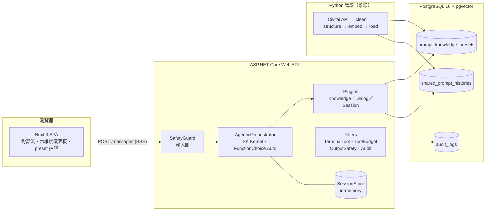

# 子專案 4：收尾與展示 — 實作計畫

> **For agentic workers:** REQUIRED SUB-SKILL: Use superpowers:subagent-driven-development (recommended) or superpowers:executing-plans to implement this plan task-by-task. Steps use checkbox (`- [ ]`) syntax for tracking.

**Goal:** clone 下來、填一把 Gemini key、`docker compose up`，就能在瀏覽器跑完整段對話且知識庫有資料；repo 同時有 CI、README、授權與資料來源說明。

**Architecture:** compose 四個服務 `db` → `seed`（一次性，空庫才從 GitHub Release 下載 dump 灌入）→ `api`（.NET 多階段 build）→ `frontend`（`nuxi generate` 靜態檔交給 nginx，nginx 反代 `/api`、`/health`、`/swagger` 且不緩衝 SSE）。知識庫 dump 由 `scripts/export_seed.py` 從暫時複製的資料庫匯出。preset 詳情多回 `sourceRef`／`sourceUrl`，抽屜顯示出處連結。CI 四個平行 job，不部署。

**Tech Stack:** Docker Compose v2、`pgvector/pgvector:pg16`、`mcr.microsoft.com/dotnet/{sdk,aspnet}:10.0`、`node:22-alpine`、`nginx:alpine`、GitHub Actions、GitHub Release（`gh` CLI 2.97）、Python 3.12+ 標準函式庫、xUnit、vitest。

**Spec:** [docs/superpowers/specs/2026-09-24-subproject-4-packaging-design.md](../specs/2026-09-24-subproject-4-packaging-design.md)。主規格 [2026-09-21-genai-prompt-copilot-design.md](../specs/2026-09-21-genai-prompt-copilot-design.md) §3、§10.1、§13、§14。資料來源 [docs/資料來源.md](../../資料來源.md)。

## Global Constraints

- **兩階段**：Task 1–10 是形狀階段，**不**從零起整套、**不**上傳 Release、**不**拍截圖。Task 11 是真實測試階段，要等使用者說開始。
- 所有 UI 文案與文件繁體中文；shell／YAML／Dockerfile 的訊息也用繁中（跟 `manual-tests/start_api.py` 一致）。
- Release 資產固定：tag `seed-v1`、檔名 `prompt_copilot_seed_v1.dump`、URL `https://github.com/zhengjielin2018-web/GenAIPromptCopilot/releases/download/seed-v1/prompt_copilot_seed_v1.dump`。
- compose 的 `SEED_URL` 用 `${SEED_URL-預設}`（**沒有冒號**）：`.env` 沒這行 → 預設；有這行且為空 → 跳過種子；有值 → 用該值。
- dump 是 `pg_dump -Fc --data-only`，只含 `prompt_knowledge_presets` 與 `shared_prompt_histories`；schema 仍由 `db/init/001_schema.sql` 單一來源。
- 出處 URL 由伺服器算：`civitai:<imageId>[:<idx>]` → `https://civitai.com/images/<imageId>`；`kisegae:*` → `https://github.com/hayde0096/Kisegaeningyou`；其他 → null。
- 程式碼授權 MIT，著作權人 `zhengjielin2018`；資料授權另述於 `docs/資料來源.md`，兩者不混寫。
- 這台機器的 Node 不在 shell PATH 上。跑 npm 前先：`export PATH="$LOCALAPPDATA/Microsoft/WinGet/Packages/OpenJS.NodeJS.22_Microsoft.Winget.Source_8wekyb3d8bbwe/node-v22.23.2-win-x64:$PATH"`（bash）。
- Python 用 `scripts/.venv/Scripts/python.exe`（已裝 ruff 與 pytest），在 `scripts/` 目錄下跑 `python -m pytest`、`python -m ruff check .`。
- `dotnet test` 在 `src/` 目錄下跑。**API 在跑時不能 `dotnet build`／`dotnet test`**（dll 鎖住）。
- Docker Desktop 要開著；`db` 容器目前有資料（presets 19,354、histories 6,294），Task 5、6 的實跑靠它。
- 每個 commit 前對應的測試要綠：後端任務 `dotnet test`；前端任務 `npm test` + `npm run build`；Python 任務 `ruff check .` + `pytest`；Docker 任務 `docker compose config` + 對應的 `docker compose build <service>`。
- 文件跟程式**同一個 commit**（Swagger 描述、主規格、`docs/資料來源.md`、各 README）。
- Commit 訊息結尾加 `Co-Authored-By: Claude Fable 5.1 <noreply@anthropic.com>`。
- 不動 `Prompts/system.md`、不動子專案 2 的編排邏輯、不動 Python 管線本體。

## Review Focus

Spec 暗示但原本沒有測試的五種情況，每條都已把測試釘進擁有那段程式的任務：

1. **`SEED_URL` 設了但下載失敗**（404、DNS 錯、斷網）：seed 要以非零退出、不留半灌的資料，讓 compose 停下來印原因。→ Task 5 用連不到的 URL 跑 `docker compose run --rm seed`，斷言非零退出且訊息可讀；`pg_restore --single-transaction` 保證失敗不留資料。
2. **`SEED_URL` 三種狀態**（沒這行／空／有值）在 compose 插值後是否真的分得開：`:-` 與 `-` 差一個冒號，寫錯就變成「永遠灌預設」。→ Task 5 用三個 `--env-file` 跑 `docker compose config` 並 grep 解析後的值。
3. **`dotnet publish` 沒帶出 `facets.yaml` 與 `system.md`**：API 起得來但第一輪就炸。→ Task 3 在 build 完的 image 裡 `ls` 這兩個檔。
4. **深連結與重載打到 nginx**（例如使用者在 `/` 以外的路徑重新整理）：`ssr: false` 的 SPA 要回 `index.html` 而不是 404。→ Task 4 起容器 `curl /some/deep/path` 斷言 200 且內容含 `id="__nuxt"`。
5. **`export_seed.py` 在 API 還連著資料庫時跑**：`CREATE DATABASE … TEMPLATE` 會被拒絕，錯誤訊息是 PostgreSQL 的英文。→ Task 6 `explain_failure` 把 `is being accessed by other users` 翻成「先停 API」的中文指示，並測 `pg_dump` 失敗時 `DROP DATABASE` 仍會執行。

nginx 是否真的不緩衝 SSE 只有真實測試 P3 能證明（Task 11）；形狀階段以 `nginx -t` 驗證設定合法。

---

## 檔案結構

**新建**

| 檔案 | 責任 |
| :--- | :--- |
| `src/PromptCopilot.Api/Data/SourceAttribution.cs` | `source_ref` 前綴 → 出處 URL 的純函式 |
| `src/PromptCopilot.Api.Tests/Data/SourceAttributionTests.cs` | 上面那個的測試 |
| `src/PromptCopilot.Frontend/tests/copy.test.ts` | `sourceName` 測試 |
| `docker/Dockerfile.api` | API 多階段 build |
| `docker/Dockerfile.frontend` | `nuxi generate` → nginx |
| `docker/nginx.conf` | 靜態檔 + 反代 + SPA fallback |
| `docker/Dockerfile.seed` | pgvector 底圖 + curl + `seed.sh` |
| `docker/seed.sh` | 空庫才下載並 `pg_restore` |
| `.dockerignore` | 不把 `bin/`、`obj/`、`node_modules/`、`.env` 送進 build context |
| `.gitattributes` | `*.sh` 強制 LF，Windows checkout 不會弄壞 shell script |
| `scripts/export_seed.py` | 從暫時複製的資料庫匯出 dump，印上傳指令 |
| `scripts/tests/test_export_seed.py` | 上面那個的測試（不碰 docker） |
| `.github/workflows/ci.yml` | 四個 job |
| `README.md` | 根目錄 README |
| `LICENSE` | MIT |

**修改**

| 檔案 | 改動 |
| :--- | :--- |
| `src/PromptCopilot.Api/Data/PresetRepository.cs` | 讀 `source_ref`；`PresetDetail` 加 `SourceRef`、`SourceUrl`；class 改可繼承、`GetAsync` 改 virtual 讓端點測試能 fake |
| `src/PromptCopilot.Api/Endpoints/ReferenceEndpoints.cs` | Swagger 描述加兩個欄位 |
| `src/PromptCopilot.Api.Tests/Endpoints/EndpointTests.cs` | `FakePresets` + `sourceUrl` 端點測試 |
| `src/PromptCopilot.Frontend/types/api.ts` | `PresetDetail` 加兩個欄位 |
| `src/PromptCopilot.Frontend/lib/copy.ts` | `sourceName(sourceRef)` |
| `src/PromptCopilot.Frontend/components/PresetDrawer.vue` | 出處連結 |
| `docker-compose.yml` | 加 `seed`、`api`、`frontend` |
| `.env.example` | `SEED_URL` 註解、`GEMINI_API_KEY` 用途 |
| `docs/資料來源.md` | 新增「公開散布與免責聲明」；署名機制標記已實作 |
| 主規格 | 狀態列、§10.1、§13、§14 |
| `manual-tests/README.md`、`src/PromptCopilot.Frontend/README.md` | 指向 compose |
| spec §5 | docker job 改為三個 image（含 seed） |

---

### Task 1: 出處 URL（後端）

**Files:**
- Create: `src/PromptCopilot.Api/Data/SourceAttribution.cs`
- Create: `src/PromptCopilot.Api.Tests/Data/SourceAttributionTests.cs`
- Modify: `src/PromptCopilot.Api/Data/PresetRepository.cs`
- Modify: `src/PromptCopilot.Api/Endpoints/ReferenceEndpoints.cs`（`/api/presets/{id}` 的描述）
- Modify: `src/PromptCopilot.Api.Tests/Endpoints/EndpointTests.cs`

**Interfaces:**
- Produces: `PromptCopilot.Api.Data.SourceAttribution.UrlFor(string? sourceRef) : string?`；`PresetDetail` 尾端多兩個欄位 `string? SourceRef, string? SourceUrl`（JSON `sourceRef`、`sourceUrl`）。Task 2 的前端型別對應這兩個欄位。

- [ ] **Step 1: 寫失敗的純函式測試**

`src/PromptCopilot.Api.Tests/Data/SourceAttributionTests.cs`：

```csharp
using PromptCopilot.Api.Data;

namespace PromptCopilot.Api.Tests.Data;

public class SourceAttributionTests
{
    /// <summary>presets 是三段式 civitai:&lt;imageId&gt;:&lt;idx&gt;，histories 是兩段式；兩種都指到同一張圖的頁面。</summary>
    [Theory]
    [InlineData("civitai:12345:0", "https://civitai.com/images/12345")]
    [InlineData("civitai:12345", "https://civitai.com/images/12345")]
    [InlineData("kisegae:1741156656403", "https://github.com/hayde0096/Kisegaeningyou")]
    public void Known_prefixes_map_to_their_source_page(string sourceRef, string expected) =>
        Assert.Equal(expected, SourceAttribution.UrlFor(sourceRef));

    /// <summary>使用者存的紀錄 source_ref 是 NULL；未知前綴不能猜一個網址出來。</summary>
    [Theory]
    [InlineData(null)]
    [InlineData("")]
    [InlineData("   ")]
    [InlineData("danbooru:99")]
    [InlineData("civitai:")]
    [InlineData("civitai:abc")]
    public void Unknown_or_missing_refs_have_no_url(string? sourceRef) =>
        Assert.Null(SourceAttribution.UrlFor(sourceRef));
}
```

- [ ] **Step 2: 跑測試確認編譯失敗**

Run（在 `src/`）：`dotnet test --filter "FullyQualifiedName~SourceAttributionTests"`
Expected: 編譯錯誤 `SourceAttribution` 不存在。

- [ ] **Step 3: 實作 `SourceAttribution`**

`src/PromptCopilot.Api/Data/SourceAttribution.cs`：

```csharp
namespace PromptCopilot.Api.Data;

/// <summary>source_ref 前綴 → 出處頁面。docs/資料來源.md 要求顯示 image_url 時一併顯示出處；
/// 規則放伺服器，前端只顯示。來源多一種只改這裡。</summary>
public static class SourceAttribution
{
    public const string KisegaeRepo = "https://github.com/hayde0096/Kisegaeningyou";

    public static string? UrlFor(string? sourceRef)
    {
        if (string.IsNullOrWhiteSpace(sourceRef)) return null;
        var parts = sourceRef.Split(':');
        return parts[0] switch
        {
            "civitai" when parts.Length >= 2 && parts[1].Length > 0 && parts[1].All(char.IsAsciiDigit)
                => $"https://civitai.com/images/{parts[1]}",
            "kisegae" => KisegaeRepo,
            _ => null,
        };
    }
}
```

- [ ] **Step 4: 跑測試確認通過**

Run：`dotnet test --filter "FullyQualifiedName~SourceAttributionTests"`
Expected: 9 個案例全過。

- [ ] **Step 5: 寫失敗的端點測試**

在 `src/PromptCopilot.Api.Tests/Endpoints/EndpointTests.cs`：

`FakeHistories` 下面加一個 fake（跟它同一種寫法）：

```csharp
    /// <summary>不打 DB。id 1 是一筆 civitai 的 preset，其他都不存在。</summary>
    private sealed class FakePresets() : PresetRepository(null!)
    {
        public override Task<PresetDetail?> GetAsync(long id, CancellationToken ct) => Task.FromResult(id == 1
            ? new PresetDetail(1, "霓虹雨夜街頭", "Scene", "昏暗雨夜的賽博龐克街道", ["neon", "rain"], ["scene.location"],
                "neon city street, rain, night", null, null, "civitai:12345:0", SourceAttribution.UrlFor("civitai:12345:0"))
            : null);
    }
```

`Factory.ConfigureWebHost` 的 `ConfigureServices` 裡，`s.AddSingleton<HistoryRepository>(new FakeHistories());` 下一行加：

```csharp
                s.AddSingleton<PresetRepository>(new FakePresets());
```

測試方法（放在 `OpenApi_lists_the_status_codes_each_route_returns` 前面）：

```csharp
    /// <summary>資料一旦公開散布，出處要跟著資料走：抽屜靠這兩個欄位顯示「出處：Civitai」。</summary>
    [Fact]
    public async Task Preset_detail_carries_its_source_ref_and_url()
    {
        var d = await _client.GetFromJsonAsync<System.Text.Json.JsonElement>("/api/presets/1");

        Assert.Equal("civitai:12345:0", d.GetProperty("sourceRef").GetString());
        Assert.Equal("https://civitai.com/images/12345", d.GetProperty("sourceUrl").GetString());
        Assert.Equal(HttpStatusCode.NotFound, (await _client.GetAsync("/api/presets/2")).StatusCode);
    }
```

- [ ] **Step 6: 跑測試確認失敗**

Run：`dotnet test --filter "FullyQualifiedName~EndpointTests"`
Expected: 編譯錯誤——`PresetRepository` 是 sealed、`GetAsync` 不是 virtual、`PresetDetail` 沒有那兩個參數。

- [ ] **Step 7: 改 `PresetRepository`**

`src/PromptCopilot.Api/Data/PresetRepository.cs`：

`PresetDetail` 改成：

```csharp
public sealed record PresetDetail(long Id, string Title, string Category, string Description, IReadOnlyList<string> Tags,
    IReadOnlyList<string> FacetIds, string PromptSnippet, string? NegativeSnippet, string? ImageUrl,
    string? SourceRef, string? SourceUrl);
```

`public sealed class PresetRepository(NpgsqlDataSource ds)` 改成 `public class PresetRepository(NpgsqlDataSource ds)`（跟 `HistoryRepository` 同一種做法，讓端點測試能 fake）。

`GetSql` 改成：

```csharp
    private const string GetSql = """
        SELECT id, title, category, description, tags, facet_ids, prompt_snippet, negative_snippet, image_url, source_ref
        FROM prompt_knowledge_presets WHERE id = @id
        """;
```

`GetAsync` 改成：

```csharp
    public virtual async Task<PresetDetail?> GetAsync(long id, CancellationToken ct)
    {
        await using var cmd = ds.CreateCommand(GetSql);
        cmd.Parameters.AddWithValue("id", id);
        await using var r = await cmd.ExecuteReaderAsync(ct);
        if (!await r.ReadAsync(ct)) return null;
        var sourceRef = r.IsDBNull(9) ? null : r.GetString(9);
        return new PresetDetail(r.GetInt64(0), r.GetString(1), r.GetString(2), r.GetString(3), r.GetFieldValue<string[]>(4),
            r.GetFieldValue<string[]>(5), r.GetString(6), r.IsDBNull(7) ? null : r.GetString(7), r.IsDBNull(8) ? null : r.GetString(8),
            sourceRef, SourceAttribution.UrlFor(sourceRef));
    }
```

- [ ] **Step 8: Swagger 描述**

`src/PromptCopilot.Api/Endpoints/ReferenceEndpoints.cs` 的 `/api/presets/{id:long}` 描述第一段改成：

```text
回傳完整內容：標題、分類、說明、tags、對應的 facet、`promptSnippet`、`negativeSnippet`、`imageUrl`（指向來源網站的原圖，本服務不轉存）、`sourceRef`（資料來源識別，如 `civitai:12345:0`）、`sourceUrl`（出處頁面；前端顯示圖片時要一併顯示這個連結，見 `docs/資料來源.md`；來源不明時為 null）。
```

- [ ] **Step 9: 跑全部後端測試**

Run（在 `src/`）：`dotnet test`
Expected: 全綠（原 147 + 新 10）。

- [ ] **Step 10: Commit**

```bash
git add src/PromptCopilot.Api/Data/SourceAttribution.cs src/PromptCopilot.Api/Data/PresetRepository.cs src/PromptCopilot.Api/Endpoints/ReferenceEndpoints.cs src/PromptCopilot.Api.Tests/Data/SourceAttributionTests.cs src/PromptCopilot.Api.Tests/Endpoints/EndpointTests.cs
git commit -m "feat(api): preset detail carries sourceRef and a server-computed sourceUrl

Co-Authored-By: Claude Fable 5.1 <noreply@anthropic.com>"
```

---

### Task 2: 出處連結（前端）

**Files:**
- Modify: `src/PromptCopilot.Frontend/types/api.ts`（`PresetDetail`）
- Modify: `src/PromptCopilot.Frontend/lib/copy.ts`
- Create: `src/PromptCopilot.Frontend/tests/copy.test.ts`
- Modify: `src/PromptCopilot.Frontend/components/PresetDrawer.vue`

**Interfaces:**
- Consumes: Task 1 的 JSON 欄位 `sourceRef`、`sourceUrl`。
- Produces: `sourceName(sourceRef: string | null): string | null`（`lib/copy.ts`）。

- [ ] **Step 1: 寫失敗的測試**

`src/PromptCopilot.Frontend/tests/copy.test.ts`：

```ts
import { describe, it, expect } from 'vitest'
import { sourceName } from '../lib/copy'

describe('sourceName', () => {
  it('把 source_ref 前綴翻成給人看的來源名稱', () => {
    expect(sourceName('civitai:12345:0')).toBe('Civitai')
    expect(sourceName('kisegae:1741156656403')).toBe('Kisegaeningyou')
  })

  it('沒有來源或不認識的前綴回 null，抽屜就退回原本那句話', () => {
    expect(sourceName(null)).toBeNull()
    expect(sourceName('')).toBeNull()
    expect(sourceName('danbooru:1')).toBeNull()
  })
})
```

- [ ] **Step 2: 跑測試確認失敗**

Run（在 `src/PromptCopilot.Frontend/`，PATH 已加 Node）：`npm test -- tests/copy.test.ts`
Expected: FAIL，`sourceName` 不是匯出的函式。

- [ ] **Step 3: 實作**

`src/PromptCopilot.Frontend/lib/copy.ts` 結尾加：

```ts
/** source_ref 前綴 → 來源名稱。URL 由後端算（sourceUrl），這裡只管顯示的字。 */
const SOURCE_NAMES: Record<string, string> = {
  civitai: 'Civitai',
  kisegae: 'Kisegaeningyou',
}

export function sourceName(sourceRef: string | null): string | null {
  if (!sourceRef) return null
  return SOURCE_NAMES[sourceRef.split(':')[0]] ?? null
}
```

`src/PromptCopilot.Frontend/types/api.ts` 的 `PresetDetail` 在 `imageUrl: string | null` 後加：

```ts
  sourceRef: string | null
  sourceUrl: string | null
```

- [ ] **Step 4: 跑測試確認通過**

Run：`npm test -- tests/copy.test.ts`
Expected: 2 passed。

- [ ] **Step 5: 抽屜顯示出處**

`src/PromptCopilot.Frontend/components/PresetDrawer.vue`：

把 `<p class="mt-5 text-[11px] text-muted">圖片來自來源網站，本服務不轉存。</p>` 換成：

```vue
        <p class="mt-5 text-[11px] text-muted">
          <template v-if="preset.sourceUrl && sourceName(preset.sourceRef)">
            出處：<a :href="preset.sourceUrl" target="_blank" rel="noopener noreferrer" class="underline underline-offset-2 hover:text-ink">{{ sourceName(preset.sourceRef) }}</a>。圖片不轉存。
          </template>
          <template v-else>圖片來自來源網站，本服務不轉存。</template>
        </p>
```

`<script setup>` 的 `import type { PresetDetail } from '../types/api'` 下一行加：

```ts
import { sourceName } from '../lib/copy'
```

- [ ] **Step 6: 全部前端測試與 build**

Run：`npm test && npm run build`
Expected: 52 passed；build 無型別錯誤。

- [ ] **Step 7: Commit**

```bash
git add src/PromptCopilot.Frontend/types/api.ts src/PromptCopilot.Frontend/lib/copy.ts src/PromptCopilot.Frontend/tests/copy.test.ts src/PromptCopilot.Frontend/components/PresetDrawer.vue
git commit -m "feat(frontend): preset drawer links to the source page (Civitai / Kisegaeningyou)

Co-Authored-By: Claude Fable 5.1 <noreply@anthropic.com>"
```

---

### Task 3: `Dockerfile.api` 與 compose `api` 服務

**Files:**
- Create: `docker/Dockerfile.api`
- Create: `.dockerignore`
- Modify: `docker-compose.yml`（加 `api`；`seed` 在 Task 5 才加，這裡 `api` 先只依賴 `db`）

**Interfaces:**
- Produces: image 內 `/app/PromptCopilot.Api.dll`，聽 `8080`；compose 服務名 `api`（Task 4 的 nginx 反代到 `api:8080`）。環境變數 `Llm__ApiKey`、`Database__ConnectionString`。

- [ ] **Step 1: `.dockerignore`**

repo 根目錄 `.dockerignore`：

```text
# build 產物與相依：image 內自己 restore／npm ci
**/bin/
**/obj/
**/node_modules/
**/.nuxt/
**/.output/
**/.venv/
**/__pycache__/

# 機密與本機資料
.env
**/appsettings.*.json
!**/appsettings.Development.json
scripts/data/
.backup-pre-expansion/

# 不進 image 的東西
.git/
.github/
.superpowers/
docs/
manual-tests/
```

- [ ] **Step 2: `Dockerfile.api`**

`docker/Dockerfile.api`（build context 是 repo 根目錄）：

```dockerfile
# 多階段：sdk 編譯，aspnet 執行。Configuration/facets.yaml 與 Prompts/system.md 由 csproj 的
# CopyToOutputDirectory 帶進 publish 輸出。
FROM mcr.microsoft.com/dotnet/sdk:10.0 AS build
WORKDIR /src
COPY src/PromptCopilot.Api/PromptCopilot.Api.csproj PromptCopilot.Api/
RUN dotnet restore PromptCopilot.Api/PromptCopilot.Api.csproj
COPY src/PromptCopilot.Api/ PromptCopilot.Api/
RUN dotnet publish PromptCopilot.Api/PromptCopilot.Api.csproj -c Release -o /app --no-restore

FROM mcr.microsoft.com/dotnet/aspnet:10.0
WORKDIR /app
COPY --from=build /app .
ENV ASPNETCORE_URLS=http://+:8080
EXPOSE 8080
# aspnet image 沒有 curl；用 bash 的 /dev/tcp 探埠。start-period 給 JIT 與 Npgsql 連線暖機。
HEALTHCHECK --interval=5s --timeout=3s --start-period=20s --retries=12 \
  CMD bash -c 'exec 3<>/dev/tcp/127.0.0.1/8080' || exit 1
ENTRYPOINT ["dotnet", "PromptCopilot.Api.dll"]
```

- [ ] **Step 3: compose 加 `api`**

`docker-compose.yml` 的 `db` 服務後、`volumes:` 前加：

```yaml
  api:
    build:
      context: .
      dockerfile: docker/Dockerfile.api
    container_name: prompt-copilot-api
    depends_on:
      db:
        condition: service_healthy
    environment:
      ASPNETCORE_ENVIRONMENT: Production
      # 同一把 key 給對話與 embedding（GeminiEmbeddingClient 也讀 Llm:ApiKey）
      Llm__ApiKey: ${GEMINI_API_KEY:?請在 .env 填 GEMINI_API_KEY}
      Database__ConnectionString: Host=db;Port=5432;Database=${POSTGRES_DB:-prompt_copilot};Username=${POSTGRES_USER:-postgres};Password=${POSTGRES_PASSWORD:-postgres}
    ports:
      - "${API_PORT:-5000}:8080"
```

- [ ] **Step 4: 驗證設定與 build**

Run（repo 根目錄）：

```bash
docker compose config --quiet && echo CONFIG_OK
docker compose build api
```

Expected: `CONFIG_OK`；build 成功（第一次要拉 sdk image，數分鐘）。

- [ ] **Step 5: 驗證 publish 帶出設定檔（Review Focus 3）**

```bash
docker run --rm --entrypoint ls genaipromptcopilot-api /app/Configuration/facets.yaml /app/Prompts/system.md /app/PromptCopilot.Api.dll
```

image 名稱是 compose 預設的 `<專案目錄名小寫>-<服務名>`；若不同，用 `docker images | grep api` 確認後替換。
Expected: 三個路徑都列出來，沒有 `No such file`。

- [ ] **Step 6: 起 api 對本機 db 跑一次 health**

```bash
docker compose up -d api
sleep 25
docker compose ps api
curl -s http://localhost:5000/health
docker compose stop api
```

Expected: `ps` 顯示 `healthy`；`/health` 回 `{"status":"ok"}`。若 `.env` 的 `POSTGRES_PORT` 不是 5432 也沒關係，容器內走 `db:5432`。

- [ ] **Step 7: Commit**

```bash
git add docker/Dockerfile.api .dockerignore docker-compose.yml
git commit -m "feat(docker): API image (sdk build, aspnet runtime) and the compose api service

Co-Authored-By: Claude Fable 5.1 <noreply@anthropic.com>"
```

---

### Task 4: `Dockerfile.frontend`、`nginx.conf` 與 compose `frontend` 服務

**Files:**
- Create: `docker/Dockerfile.frontend`
- Create: `docker/nginx.conf`
- Modify: `docker-compose.yml`（加 `frontend`）

**Interfaces:**
- Consumes: Task 3 的服務名 `api`、埠 `8080`。
- Produces: nginx 聽 `80`，主機 `8080`。

- [ ] **Step 1: `nginx.conf`**

`docker/nginx.conf`：

```nginx
# 靜態 SPA + 反代 API。SSE 經此不得緩衝（主規格 §10.3、前端設計 §2.5）。
server {
    listen 80;
    server_name _;
    root /usr/share/nginx/html;
    index index.html;

    # /api/*、/health、/swagger/* 原路徑轉給 api
    location ~ ^/(api|health|swagger)(/|$) {
        proxy_pass http://api:8080;
        proxy_http_version 1.1;
        proxy_set_header Connection "";
        proxy_set_header Host $host;
        proxy_set_header X-Forwarded-For $proxy_add_x_forwarded_for;
        proxy_buffering off;
        proxy_cache off;
        # 單輪上限 120 秒（Orchestrator:TurnTimeoutSeconds），留退避空間
        proxy_read_timeout 180s;
        proxy_send_timeout 180s;
    }

    # ssr: false 的 SPA：任何路徑重載都回 index.html
    location / {
        try_files $uri $uri/ /index.html;
    }
}
```

- [ ] **Step 2: `Dockerfile.frontend`**

`docker/Dockerfile.frontend`：

```dockerfile
# nuxi generate 產純靜態檔（ssr: false），交給 nginx；不需要 Node 執行時。
FROM node:22-alpine AS build
WORKDIR /app
COPY src/PromptCopilot.Frontend/package.json src/PromptCopilot.Frontend/package-lock.json ./
RUN npm ci
COPY src/PromptCopilot.Frontend/ .
RUN npx nuxi generate

FROM nginx:alpine
COPY docker/nginx.conf /etc/nginx/conf.d/default.conf
COPY --from=build /app/.output/public /usr/share/nginx/html
EXPOSE 80
```

- [ ] **Step 3: compose 加 `frontend`**

`docker-compose.yml` 的 `api` 後加：

```yaml
  frontend:
    build:
      context: .
      dockerfile: docker/Dockerfile.frontend
    container_name: prompt-copilot-frontend
    depends_on:
      api:
        condition: service_healthy
    ports:
      - "${FRONTEND_PORT:-8080}:80"
```

- [ ] **Step 4: build 與 nginx 設定檢查**

```bash
docker compose config --quiet && echo CONFIG_OK
docker compose build frontend
docker run --rm --entrypoint nginx genaipromptcopilot-frontend -t
```

Expected: build 成功；`nginx -t` 印 `syntax is ok` 與 `test is successful`（`api` 這個 upstream 名稱在 `-t` 時不會解析，不影響）。

- [ ] **Step 5: 深連結回 index.html（Review Focus 4）**

nginx 啟動時會解析 `api` 主機名，單獨起容器要給它一個假的：

```bash
docker network create pc-probe 2>/dev/null || true
docker run -d --rm --name pc-fake-api --network pc-probe --network-alias api alpine sleep 60
docker run -d --rm --name pc-frontend-probe --network pc-probe -p 18080:80 genaipromptcopilot-frontend
sleep 2
curl -s -o /dev/null -w "%{http_code}\n" http://localhost:18080/
curl -s http://localhost:18080/some/deep/path | grep -c 'id="__nuxt"'
docker stop pc-frontend-probe pc-fake-api
docker network rm pc-probe
```

Expected: 第一個 `200`；第二個 `1`（深路徑拿到的是 `index.html`）。

- [ ] **Step 6: Commit**

```bash
git add docker/Dockerfile.frontend docker/nginx.conf docker-compose.yml
git commit -m "feat(docker): static frontend image behind nginx, SSE proxied unbuffered

Co-Authored-By: Claude Fable 5.1 <noreply@anthropic.com>"
```

---

### Task 5: `seed` 服務、`.env.example`、`.gitattributes`

**Files:**
- Create: `docker/seed.sh`
- Create: `docker/Dockerfile.seed`
- Create: `.gitattributes`
- Modify: `docker-compose.yml`（加 `seed`；`api` 加依賴）
- Modify: `.env.example`

**Interfaces:**
- Consumes: `db` 服務；`POSTGRES_*`。
- Produces: compose 服務 `seed`，成功結束後 `api` 才起。

- [ ] **Step 1: `.gitattributes`**

repo 根目錄 `.gitattributes`：

```text
# shell script 進容器要 LF；Windows 的 autocrlf 不得改它
*.sh text eol=lf
```

- [ ] **Step 2: `seed.sh`**

`docker/seed.sh`：

```sh
#!/bin/sh
# 首次啟動灌知識庫種子。冪等：表裡已有資料就跳過；SEED_URL 空就跳過。
# 任一步失敗以非零退出，compose 會停在這裡並印出原因，api 不會起來。
set -eu

if [ -z "${SEED_URL:-}" ]; then
  echo "seed: 未設定 SEED_URL，跳過種子。知識庫是空的，要自己跑 scripts/seed_data.py。"
  exit 0
fi

count=$(psql -tAc "SELECT count(*) FROM prompt_knowledge_presets")
if [ "$count" -gt 0 ]; then
  echo "seed: 已有資料 ${count} 筆，跳過。"
  exit 0
fi

echo "seed: 下載 ${SEED_URL} …"
if ! curl -fL --retry 3 --retry-delay 2 -o /tmp/seed.dump "$SEED_URL"; then
  echo "seed: 下載失敗。檢查網路，或在 .env 把 SEED_URL 設成空字串跳過種子。" >&2
  exit 1
fi

echo "seed: 匯入中（單一交易，失敗不留半套資料）…"
pg_restore --data-only --no-owner --single-transaction --dbname="$PGDATABASE" /tmp/seed.dump
rm -f /tmp/seed.dump

psql -tAc "SELECT 'seed: presets ' || count(*) FROM prompt_knowledge_presets
           UNION ALL SELECT 'seed: histories ' || count(*) FROM shared_prompt_histories"
echo "seed: 完成。"
```

- [ ] **Step 3: `Dockerfile.seed`**

`docker/Dockerfile.seed`：

```dockerfile
# 跟 db 同一個底圖，pg_restore 版本才跟 server 一致。只多裝 curl。
FROM pgvector/pgvector:pg16
RUN apt-get update \
 && apt-get install -y --no-install-recommends curl ca-certificates \
 && rm -rf /var/lib/apt/lists/*
COPY docker/seed.sh /usr/local/bin/seed.sh
# .gitattributes 已強制 LF；這行是保險
RUN sed -i 's/\r$//' /usr/local/bin/seed.sh && chmod +x /usr/local/bin/seed.sh
ENTRYPOINT ["/usr/local/bin/seed.sh"]
```

- [ ] **Step 4: compose 加 `seed`，`api` 加依賴**

`docker-compose.yml` 的 `db` 後、`api` 前加：

```yaml
  seed:
    build:
      context: .
      dockerfile: docker/Dockerfile.seed
    container_name: prompt-copilot-seed
    depends_on:
      db:
        condition: service_healthy
    environment:
      PGHOST: db
      PGPORT: 5432
      PGUSER: ${POSTGRES_USER:-postgres}
      PGPASSWORD: ${POSTGRES_PASSWORD:-postgres}
      PGDATABASE: ${POSTGRES_DB:-prompt_copilot}
      # 「-」不是「:-」：.env 沒這行 → 預設 Release 資產；有這行且為空 → 跳過種子
      SEED_URL: ${SEED_URL-https://github.com/zhengjielin2018-web/GenAIPromptCopilot/releases/download/seed-v1/prompt_copilot_seed_v1.dump}
    restart: "no"
```

`api` 的 `depends_on` 改成：

```yaml
    depends_on:
      db:
        condition: service_healthy
      seed:
        condition: service_completed_successfully
```

- [ ] **Step 5: `.env.example`**

`.env.example` 的 `# ---- Gemini ----` 區塊前加：

```text
# ---- docker compose 一鍵啟動 ----
# GEMINI_API_KEY（下方）同時給 Python 管線與 api 容器（compose 映射成 Llm__ApiKey）。
# SEED_URL：首次啟動灌進知識庫的 dump。不寫這行 = 用 compose 裡的預設 Release 資產；
# 想自己跑 seed_data.py 而不灌種子，把下一行的註解拿掉（設成空字串）。
# SEED_URL=
# 主機埠：前端 http://localhost:8080、API http://localhost:5000
# FRONTEND_PORT=8080
# API_PORT=5000

```

- [ ] **Step 6: 三種 `SEED_URL` 狀態（Review Focus 2）**

```bash
docker compose build seed
cp .env /tmp/env-default && grep -v '^SEED_URL' /tmp/env-default > /tmp/env-nosetting
{ cat /tmp/env-nosetting; echo 'SEED_URL='; } > /tmp/env-empty
{ cat /tmp/env-nosetting; echo 'SEED_URL=http://example.test/x.dump'; } > /tmp/env-value
for f in nosetting empty value; do echo "== $f"; docker compose --env-file /tmp/env-$f config | grep 'SEED_URL:'; done
rm /tmp/env-default /tmp/env-nosetting /tmp/env-empty /tmp/env-value
```

Expected：
- `nosetting` → `SEED_URL: https://github.com/zhengjielin2018-web/GenAIPromptCopilot/releases/download/seed-v1/prompt_copilot_seed_v1.dump`
- `empty` → `SEED_URL: ""`
- `value` → `SEED_URL: http://example.test/x.dump`

- [ ] **Step 7: 對本機有資料的 db 跑 seed → 跳過**

```bash
docker compose run --rm seed; echo "exit=$?"
```

Expected: 印 `seed: 已有資料 19354 筆，跳過。`，`exit=0`。

- [ ] **Step 8: 下載失敗要非零退出（Review Focus 1）**

這台 db 有資料會先跳過，所以用一個空庫測。起一個暫時的 db 容器：

```bash
docker run -d --rm --name pc-empty-db -e POSTGRES_PASSWORD=x -e POSTGRES_DB=prompt_copilot -v "$PWD/db/init:/docker-entrypoint-initdb.d:ro" pgvector/pgvector:pg16
sleep 8
docker run --rm --network container:pc-empty-db -e PGHOST=127.0.0.1 -e PGUSER=postgres -e PGPASSWORD=x -e PGDATABASE=prompt_copilot -e SEED_URL=http://127.0.0.1:1/nope.dump genaipromptcopilot-seed; echo "exit=$?"
docker run --rm --network container:pc-empty-db -e PGHOST=127.0.0.1 -e PGUSER=postgres -e PGPASSWORD=x -e PGDATABASE=prompt_copilot -e SEED_URL= genaipromptcopilot-seed; echo "exit=$?"
docker stop pc-empty-db
```

Expected: 第一次印 `seed: 下載失敗…`，`exit=1`；第二次印 `seed: 未設定 SEED_URL，跳過種子…`，`exit=0`。

- [ ] **Step 9: Commit**

```bash
git add .gitattributes docker/seed.sh docker/Dockerfile.seed docker-compose.yml .env.example
git commit -m "feat(docker): one-shot seed service restores the knowledge base from a GitHub Release dump

Co-Authored-By: Claude Fable 5.1 <noreply@anthropic.com>"
```

---

### Task 6: `scripts/export_seed.py`

**Files:**
- Create: `scripts/export_seed.py`
- Create: `scripts/tests/test_export_seed.py`
- Modify: `scripts/README.md`（加一節）

**Interfaces:**
- Produces: `scripts/data/seed/prompt_copilot_seed_v<N>.dump`（gitignore）與印出的 `gh release create` 指令。Task 11 用它。

- [ ] **Step 1: 寫失敗的測試**

`scripts/tests/test_export_seed.py`：

```python
"""export_seed 不碰 docker：run() 被換成記錄器，驗證指令順序與失敗時的收尾。"""

from __future__ import annotations

import subprocess

import pytest

import export_seed
from export_seed import (
    TEMP_DB,
    asset_name,
    explain_failure,
    export,
    gh_command,
    parse_counts,
    release_tag,
)


def test_asset_and_tag_follow_the_version():
    assert asset_name(1) == "prompt_copilot_seed_v1.dump"
    assert release_tag(3) == "seed-v3"


def test_gh_command_uploads_the_dump_to_the_versioned_release(tmp_path):
    cmd = gh_command(2, tmp_path / "prompt_copilot_seed_v2.dump")
    assert cmd.startswith("gh release create seed-v2 ")
    assert "prompt_copilot_seed_v2.dump" in cmd
    assert "--title" in cmd


def test_parse_counts_reads_psql_tuples_only_output():
    out = "presets:civitai|18977\npresets:kisegae|377\nhistories:civitai|6294\n"
    assert parse_counts(out) == {"presets:civitai": 18977, "presets:kisegae": 377, "histories:civitai": 6294}


def test_explain_failure_tells_you_to_stop_the_api():
    msg = explain_failure('ERROR:  source database "prompt_copilot" is being accessed by other users')
    assert "API" in msg
    assert "other users" not in msg


def test_explain_failure_passes_unknown_errors_through():
    assert "connection refused" in explain_failure("psql: connection refused")


class Recorder:
    """假的 run()：記下每次 docker compose 的參數，依 SQL 回固定 stdout；可指定某一步要炸。"""

    def __init__(self, fail_on: str | None = None, stderr: str = "boom"):
        self.calls: list[list[str]] = []
        self.fail_on = fail_on
        self.stderr = stderr

    def __call__(self, args, *, capture=True):
        self.calls.append(list(args))
        joined = " ".join(args)
        if self.fail_on and self.fail_on in joined:
            raise subprocess.CalledProcessError(1, args, stderr=self.stderr)
        stdout = ""
        if "UNION ALL" in joined:
            stdout = "presets:civitai|2\nhistories:civitai|1\n"
        return subprocess.CompletedProcess(args, 0, stdout=stdout, stderr="")


def _sql_of(call: list[str]) -> str:
    return call[-1]


def test_export_creates_a_copy_dumps_it_and_always_drops_it(monkeypatch, tmp_path):
    rec = Recorder()
    monkeypatch.setattr(export_seed, "run", rec)
    monkeypatch.setattr(export_seed, "SEED_DIR", tmp_path)

    out, counts = export(version=1, user="postgres", db="prompt_copilot")

    assert out == tmp_path / "prompt_copilot_seed_v1.dump"
    assert counts == {"presets:civitai": 2, "histories:civitai": 1}
    sqls = [_sql_of(c) for c in rec.calls if "psql" in c]
    assert sqls[0] == f'CREATE DATABASE {TEMP_DB} TEMPLATE "prompt_copilot"'
    assert sqls[1] == "DELETE FROM shared_prompt_histories WHERE source = 'user'"
    assert "UNION ALL" in sqls[2]
    assert sqls[-1] == f"DROP DATABASE IF EXISTS {TEMP_DB}"
    dump = next(c for c in rec.calls if "pg_dump" in c)
    assert "--data-only" in dump and "-Fc" in dump
    assert dump[dump.index("-d") + 1] == TEMP_DB
    assert dump.count("-t") == 2
    assert any(c[:2] == ["cp", f"db:/tmp/{asset_name(1)}"] for c in rec.calls)


def test_export_drops_the_copy_even_when_pg_dump_fails(monkeypatch, tmp_path):
    rec = Recorder(fail_on="pg_dump")
    monkeypatch.setattr(export_seed, "run", rec)
    monkeypatch.setattr(export_seed, "SEED_DIR", tmp_path)

    with pytest.raises(subprocess.CalledProcessError):
        export(version=1, user="postgres", db="prompt_copilot")

    assert _sql_of(rec.calls[-1]) == f"DROP DATABASE IF EXISTS {TEMP_DB}"


def test_export_explains_when_the_copy_cannot_be_created(monkeypatch, tmp_path):
    rec = Recorder(fail_on="CREATE DATABASE", stderr='source database "prompt_copilot" is being accessed by other users')
    monkeypatch.setattr(export_seed, "run", rec)
    monkeypatch.setattr(export_seed, "SEED_DIR", tmp_path)

    with pytest.raises(SystemExit) as e:
        export(version=1, user="postgres", db="prompt_copilot")

    assert "API" in str(e.value)
    # 複製都沒建成功，就沒有東西要 drop
    assert not any("DROP DATABASE" in " ".join(c) for c in rec.calls)
```

- [ ] **Step 2: 跑測試確認失敗**

Run（在 `scripts/`）：`python -m pytest tests/test_export_seed.py -q`
Expected: `ModuleNotFoundError: export_seed`。

- [ ] **Step 3: 實作**

`scripts/export_seed.py`：

```python
"""把知識庫匯出成公開的種子 dump（給 docker compose 的 seed 服務用）。

做法：複製一份資料庫 → 刪掉使用者自己存的紀錄 → pg_dump 兩張知識表（data-only）→ 丟掉複製。
本機的 prompt_copilot 不動。schema 不進 dump，由 db/init/001_schema.sql 單一來源。

只用標準函式庫，透過 docker compose exec 在 db 容器裡跑：
    python scripts/export_seed.py [--version 1]
匯出前要停掉 API（CREATE DATABASE … TEMPLATE 不允許來源庫有其他連線）。
產出在 scripts/data/seed/，不進版控；印出的 gh 指令要自己按。
"""

from __future__ import annotations

import argparse
import subprocess
import sys
from pathlib import Path

ROOT = Path(__file__).resolve().parent.parent
SEED_DIR = ROOT / "scripts" / "data" / "seed"
TABLES = ("prompt_knowledge_presets", "shared_prompt_histories")
TEMP_DB = "seed_export"
COUNT_SQL = (
    "SELECT 'presets:' || split_part(source_ref, ':', 1), count(*) FROM prompt_knowledge_presets GROUP BY 1 "
    "UNION ALL SELECT 'histories:' || source, count(*) FROM shared_prompt_histories GROUP BY 1"
)


def asset_name(version: int) -> str:
    return f"prompt_copilot_seed_v{version}.dump"


def release_tag(version: int) -> str:
    return f"seed-v{version}"


def gh_command(version: int, path: Path) -> str:
    return (
        f'gh release create {release_tag(version)} "{path}" '
        f'--title "知識庫種子 v{version}" '
        f'--notes "docker compose 首次啟動灌進知識庫的 pg_dump（data-only）。授權與免責聲明見 docs/資料來源.md。"'
    )


def parse_counts(stdout: str) -> dict[str, int]:
    counts: dict[str, int] = {}
    for line in stdout.splitlines():
        if "|" not in line:
            continue
        key, value = line.rsplit("|", 1)
        counts[key.strip()] = int(value)
    return counts


def explain_failure(stderr: str) -> str:
    if "is being accessed by other users" in stderr:
        return "prompt_copilot 還有其他連線（API 在跑？）。先停掉 API 與其他 psql 再試。"
    return stderr.strip()


def run(args: list[str], *, capture: bool = True) -> subprocess.CompletedProcess[str]:
    """docker compose 的薄封裝；測試會換掉它。"""
    return subprocess.run(
        ["docker", "compose", *args], cwd=ROOT, check=True,
        capture_output=capture, text=True, encoding="utf-8", errors="replace",
    )


def psql(user: str, db: str, sql: str) -> str:
    return run(["exec", "-T", "db", "psql", "-U", user, "-d", db, "-tAc", sql]).stdout


def export(version: int, user: str, db: str) -> tuple[Path, dict[str, int]]:
    try:
        psql(user, "postgres", f'CREATE DATABASE {TEMP_DB} TEMPLATE "{db}"')
    except subprocess.CalledProcessError as e:
        raise SystemExit(explain_failure(e.stderr or "")) from e

    remote = f"/tmp/{asset_name(version)}"
    out = SEED_DIR / asset_name(version)
    try:
        psql(user, TEMP_DB, "DELETE FROM shared_prompt_histories WHERE source = 'user'")
        counts = parse_counts(psql(user, TEMP_DB, COUNT_SQL))
        tables = [arg for t in TABLES for arg in ("-t", t)]
        run(["exec", "-T", "db", "pg_dump", "-U", user, "-d", TEMP_DB, "-Fc", "--data-only", *tables, "-f", remote])
        SEED_DIR.mkdir(parents=True, exist_ok=True)
        run(["cp", f"db:{remote}", str(out)])
        run(["exec", "-T", "db", "rm", "-f", remote])
    finally:
        psql(user, "postgres", f"DROP DATABASE IF EXISTS {TEMP_DB}")
    return out, counts


def read_env(path: Path) -> dict[str, str]:
    env: dict[str, str] = {}
    if not path.exists():
        return env
    for line in path.read_text(encoding="utf-8").splitlines():
        line = line.strip()
        if not line or line.startswith("#") or "=" not in line:
            continue
        key, value = line.split("=", 1)
        env[key.strip()] = value.strip().strip('"').strip("'")
    return env


def main(argv: list[str] | None = None) -> int:
    ap = argparse.ArgumentParser(description=__doc__, formatter_class=argparse.RawDescriptionHelpFormatter)
    ap.add_argument("--version", type=int, default=1, help="Release 版本號（tag seed-v<N>）")
    args = ap.parse_args(argv)

    env = read_env(ROOT / ".env")
    user = env.get("POSTGRES_USER", "postgres")
    db = env.get("POSTGRES_DB", "prompt_copilot")

    print(f"從 {db} 複製到 {TEMP_DB}、刪除使用者紀錄、匯出兩張知識表…")
    out, counts = export(args.version, user, db)

    print("匯出完成：")
    for key, n in sorted(counts.items()):
        print(f"  {key:<22}{n:>8,}")
    print(f"  檔案  {out}（{out.stat().st_size / 1_000_000:.1f} MB）")
    print("\n下一步（手動）：")
    print("  " + gh_command(args.version, out))
    return 0


if __name__ == "__main__":
    sys.exit(main())
```

- [ ] **Step 4: 跑測試與 ruff**

Run（在 `scripts/`）：`python -m pytest tests/test_export_seed.py -q && python -m ruff check .`
Expected: 8 passed；`All checks passed!`。

- [ ] **Step 5: 實跑一次（本機 db 有資料，API 沒在跑）**

```bash
cd scripts && ../scripts/.venv/Scripts/python.exe export_seed.py --version 1
ls -l data/seed/
```

Expected: 印出 `presets:civitai 18,977`、`presets:kisegae 377`、`histories:civitai 6,294`（若你本機有存過測試紀錄且沒刪，`histories:user` 不會出現在 dump 裡但也不會出現在這張表，因為刪除在計數前）；檔案約 104 MB；印出 `gh release create seed-v1 …`。**不要執行那條 gh 指令**（Task 11）。之後確認 `docker compose exec db psql -U postgres -lqt | grep seed_export` 沒有東西。

- [ ] **Step 6: `scripts/README.md` 加一節**

在「## Demo：中文描述 → 英文提示詞」前加：

```markdown
## 匯出公開的知識庫種子

`docker compose up` 首次啟動灌的 dump 從這裡來。它複製一份資料庫、刪掉使用者自己存的紀錄、
`pg_dump` 兩張知識表（data-only，schema 仍由 `db/init/001_schema.sql` 管），再丟掉複製。
本機的 `prompt_copilot` 不動。匯出前要先停 API。

    python export_seed.py --version 1        # 產出 data/seed/prompt_copilot_seed_v1.dump（不進版控）

它會印出 `gh release create seed-v1 …` 指令，上傳是手動的。語料擴增或換 embedding 模型後
版本號 +1，並同步 `docker-compose.yml` 的 `SEED_URL` 預設值與 `db/init/001_schema.sql` 的維度。
授權與免責聲明見 [docs/資料來源.md](../docs/資料來源.md)。
```

- [ ] **Step 7: Commit**

```bash
git add scripts/export_seed.py scripts/tests/test_export_seed.py scripts/README.md
git commit -m "feat(scripts): export_seed.py dumps the two knowledge tables from a throwaway copy

Co-Authored-By: Claude Fable 5.1 <noreply@anthropic.com>"
```

---

### Task 7: CI workflow

**Files:**
- Create: `.github/workflows/ci.yml`

- [ ] **Step 1: 寫 workflow**

`.github/workflows/ci.yml`：

```yaml
name: CI

on:
  push:
    branches: [master]
  pull_request:

concurrency:
  group: ci-${{ github.ref }}
  cancel-in-progress: true

jobs:
  dotnet:
    name: dotnet build + test
    runs-on: ubuntu-latest
    steps:
      - uses: actions/checkout@v4
      - uses: actions/setup-dotnet@v4
        with:
          dotnet-version: 10.0.x
      - run: dotnet restore src/PromptCopilot.sln
      - run: dotnet build src/PromptCopilot.sln -c Release --no-restore
      # Integration 測試沒設 PC_INTEGRATION=1 會自動 Skip（IntegrationFact）
      - run: dotnet test src/PromptCopilot.sln -c Release --no-build

  frontend:
    name: npm test + build
    runs-on: ubuntu-latest
    defaults:
      run:
        working-directory: src/PromptCopilot.Frontend
    steps:
      - uses: actions/checkout@v4
      - uses: actions/setup-node@v4
        with:
          node-version: 22
          cache: npm
          cache-dependency-path: src/PromptCopilot.Frontend/package-lock.json
      - run: npm ci
      - run: npm test
      - run: npm run build

  python:
    name: ruff + pytest
    runs-on: ubuntu-latest
    defaults:
      run:
        working-directory: scripts
    steps:
      - uses: actions/checkout@v4
      - uses: actions/setup-python@v5
        with:
          python-version: "3.12"
          cache: pip
          cache-dependency-path: scripts/requirements.txt
      - run: pip install -r requirements.txt
      - run: ruff check .
      # pyproject.toml 預設 -m 'not integration'
      - run: pytest

  docker:
    name: docker build (no push)
    runs-on: ubuntu-latest
    steps:
      - uses: actions/checkout@v4
      - uses: docker/setup-buildx-action@v3
      - name: api
        uses: docker/build-push-action@v6
        with:
          context: .
          file: docker/Dockerfile.api
          push: false
          cache-from: type=gha,scope=api
          cache-to: type=gha,mode=max,scope=api
      - name: frontend
        uses: docker/build-push-action@v6
        with:
          context: .
          file: docker/Dockerfile.frontend
          push: false
          cache-from: type=gha,scope=frontend
          cache-to: type=gha,mode=max,scope=frontend
      - name: seed
        uses: docker/build-push-action@v6
        with:
          context: .
          file: docker/Dockerfile.seed
          push: false
          cache-from: type=gha,scope=seed
          cache-to: type=gha,mode=max,scope=seed
```

- [ ] **Step 2: YAML 合法性與 job 清單**

```bash
scripts/.venv/Scripts/python.exe -c "import yaml,sys; d=yaml.safe_load(open('.github/workflows/ci.yml',encoding='utf-8')); print(sorted(d['jobs']))"
```

Expected: `['docker', 'dotnet', 'frontend', 'python']`。

- [ ] **Step 3: 本機模擬 python job（Linux 路徑差異最可能在這裡）**

在 `scripts/`：`python -m ruff check . && python -m pytest -q`
Expected: 全綠。真的在 ubuntu 上跑是 Task 11 P7。

- [ ] **Step 4: Commit**

```bash
git add .github/workflows/ci.yml
git commit -m "ci: dotnet, frontend, python and docker-build jobs; no deploy

Co-Authored-By: Claude Fable 5.1 <noreply@anthropic.com>"
```

---

### Task 8: `LICENSE` 與根目錄 `README.md`

**Files:**
- Create: `LICENSE`
- Create: `README.md`

- [ ] **Step 1: `LICENSE`**

```text
MIT License

Copyright (c) 2026 zhengjielin2018

Permission is hereby granted, free of charge, to any person obtaining a copy
of this software and associated documentation files (the "Software"), to deal
in the Software without restriction, including without limitation the rights
to use, copy, modify, merge, publish, distribute, sublicense, and/or sell
copies of the Software, and to permit persons to whom the Software is
furnished to do so, subject to the following conditions:

The above copyright notice and this permission notice shall be included in all
copies or substantial portions of the Software.

THE SOFTWARE IS PROVIDED "AS IS", WITHOUT WARRANTY OF ANY KIND, EXPRESS OR
IMPLIED, INCLUDING BUT NOT LIMITED TO THE WARRANTIES OF MERCHANTABILITY,
FITNESS FOR A PARTICULAR PURPOSE AND NONINFRINGEMENT. IN NO EVENT SHALL THE
AUTHORS OR COPYRIGHT HOLDERS BE LIABLE FOR ANY CLAIM, DAMAGES OR OTHER
LIABILITY, WHETHER IN AN ACTION OF CONTRACT, TORT OR OTHERWISE, ARISING FROM,
OUT OF OR IN CONNECTION WITH THE SOFTWARE OR THE USE OR OTHER DEALINGS IN THE
SOFTWARE.
```

- [ ] **Step 2: `README.md`**

repo 根目錄 `README.md`。截圖檔案 Task 11 才會有，先照檔名引用：

````markdown
# GenAI Prompt Copilot

[](https://github.com/zhengjielin2018-web/GenAIPromptCopilot/actions/workflows/ci.yml)

用繁體中文描述想要的畫面，系統以六個維度判斷資訊夠不夠、主動追問缺的細節、從知識庫推薦可用片段，最後產出 SD／SDXL tag 風格的英文正／負向提示詞。求職作品集專案：每個技術點都有看得見的實證，功能深度其次。


## 架構



一輪對話：使用者送一句話 → 輸入側安全過濾 → 模型在動態組出的工具清單裡自己決定要查知識庫、更新儀表板、追問、討論還是定稿 → 每個工具呼叫即時以 SSE 推到前端 → 該輪以一個終止型工具收尾。任何一步失敗整輪回滾，跟資料庫交易一樣。細節見 [docs/單輪流程說明.md](docs/單輪流程說明.md)。

## 技術對照

| 技術 | 這個專案裡做了什麼 | 看哪裡 |
| :--- | :--- | :--- |
| Semantic Kernel | 全 agentic function calling；依 session 狀態動態組工具清單；`IAutoFunctionInvocationFilter` 做終止、預算、輸出安全、稽核四道 filter；兩層 RAG | `src/PromptCopilot.Api/Orchestration/`、`Plugins/`、`Filters/`；[主規格 §4](docs/superpowers/specs/2026-09-21-genai-prompt-copilot-design.md#4-核心編排全-agentic) |
| ASP.NET Core | SSE 串流（`Channel<AgentEvent>` → `IAsyncEnumerable`）；每輪 snapshot／rollback；session 鎖 | `Streaming/`、`Sessions/`、`Endpoints/`；[主規格 §10](docs/superpowers/specs/2026-09-21-genai-prompt-copilot-design.md#10-api-與-sse-協定) |
| PostgreSQL + pgvector | 分維度檢索：GIN 過濾 facet 後 HNSW 排序；候選池大小隨結果回報 | `db/init/001_schema.sql`、`Data/`；[檢索設計](docs/superpowers/specs/2026-09-22-dimension-scoped-retrieval-design.md) |
| Python | 分階段、可重跑的資料管線：抓取→清洗→Gemini 結構化→向量化→載入；分層抓取解題材偏斜 | `scripts/`；[語料擴增設計](docs/superpowers/specs/2026-09-22-corpus-expansion-design.md) |
| Nuxt 3 | 純函式 reducer 消費 SSE；tool call 卡片與儀表板即時變燈；整頁重載恢復 | `src/PromptCopilot.Frontend/`；[前端設計](docs/superpowers/specs/2026-09-24-frontend-sse-design.md) |
| 安全合規 | 輸入側 denylist + 分類器；輸出側對定稿、討論、追問的文字與選項全檢；資料側 NSFW 過濾 | `Safety/`、`Filters/OutputSafetyFilter.cs`、`scripts/pipeline/nsfw_filter.py` |

## 一鍵跑起來

需要 Docker Desktop 與一把 [Gemini API key](https://aistudio.google.com/apikey)。

```bash
cp .env.example .env        # 填 GEMINI_API_KEY；POSTGRES_PASSWORD 隨意改
docker compose up
```

首次啟動會下載約 100 MB 的知識庫種子灌進資料庫（見下方「資料來源」），之後：

- 前端 <http://localhost:8080>
- Swagger <http://localhost:5000/swagger>

不想灌種子、要自己跑管線：`.env` 加一行 `SEED_URL=`（空字串），再照 [scripts/README.md](scripts/README.md)。

## 本機開發

| 想做什麼 | 看哪裡 |
| :--- | :--- |
| 起 API、在終端機逐輪對話 | [manual-tests/README.md](manual-tests/README.md) |
| 跑前端 dev server | [src/PromptCopilot.Frontend/README.md](src/PromptCopilot.Frontend/README.md) |
| 跑資料管線、匯出種子 | [scripts/README.md](scripts/README.md) |
| 人工 eval 案例與歷次結果 | [docs/eval-cases.md](docs/eval-cases.md) |

測試：`cd src && dotnet test`、`cd src/PromptCopilot.Frontend && npm test`、`cd scripts && pytest && ruff check .`。整合測試需要 `PC_INTEGRATION=1` 與本機資料庫，CI 不跑。

## 資料來源與免責聲明

知識庫種子是 [Civitai 公開 API](https://civitai.com) 與 [Kisegaeningyou](https://github.com/hayde0096/Kisegaeningyou) 的**衍生物**：原始提示詞經 Gemini 重新詮釋為繁中描述與結構化片段，不是逐字轉載。**圖片一律不轉存**，只保留指向上游的 URL，由瀏覽器向上游請求；產品內顯示圖片時一併顯示出處連結。Kisegaeningyou 上游未標示授權，本專案以署名與非商業用途為據收錄。本專案為非商業求職作品集，來源方或權利人提出要求即移除對應資料並重發種子。

完整說明、匯入細節與已知取捨：[docs/資料來源.md](docs/資料來源.md)。

## 文件

- [主規格](docs/superpowers/specs/2026-09-21-genai-prompt-copilot-design.md)：目標、架構、編排、facet 體系、安全、資料模型、API 協定、測試策略
- 子專案設計：[語料擴增](docs/superpowers/specs/2026-09-22-corpus-expansion-design.md)、[分維度檢索](docs/superpowers/specs/2026-09-22-dimension-scoped-retrieval-design.md)、[多輪對話](docs/superpowers/specs/2026-09-22-multi-turn-dialogue-design.md)、[前端與 SSE](docs/superpowers/specs/2026-09-24-frontend-sse-design.md)、[收尾與展示](docs/superpowers/specs/2026-09-24-subproject-4-packaging-design.md)
- [單輪流程說明](docs/單輪流程說明.md)、[eval 案例](docs/eval-cases.md)、[初步想法](docs/初步想法.md)

## 授權

程式碼與文件採 [MIT](LICENSE)。知識庫種子（GitHub Release 資產）**不在** MIT 範圍內，其狀態見上一節。
````

- [ ] **Step 3: mermaid 語法檢查**

沒有本機 mermaid 工具。把 `## 架構` 那段的 mermaid 內容貼到 <https://mermaid.live> 看得到圖再往下；或跳過，Task 11 P7 在 GitHub 上看。

- [ ] **Step 4: Commit**

```bash
git add LICENSE README.md
git commit -m "docs: root README with architecture, one-command run, data disclaimer; MIT license for the code

Co-Authored-By: Claude Fable 5.1 <noreply@anthropic.com>"
```

---

### Task 9: 文件同步

**Files:**
- Modify: `docs/資料來源.md`
- Modify: `docs/superpowers/specs/2026-09-21-genai-prompt-copilot-design.md`（狀態列、§10.1、§13、§14）
- Modify: `docs/superpowers/specs/2026-09-24-subproject-4-packaging-design.md`（§5 docker job 三個 image）
- Modify: `manual-tests/README.md`
- Modify: `src/PromptCopilot.Frontend/README.md`

- [ ] **Step 1: `docs/資料來源.md`**

「### 署名機制」那段末尾（`對應常數見 pipeline/kisegae.py 的 SOURCE_REPO。` 之後）加：

```markdown

已於子專案 4 實作：`GET /api/presets/{id}` 回 `sourceRef` 與伺服器算好的 `sourceUrl`
（`src/PromptCopilot.Api/Data/SourceAttribution.cs`），preset 抽屜底部顯示「出處：Kisegaeningyou」連結。
```

文件最末尾加新一節：

```markdown

---

## 公開散布與免責聲明

`docker compose up` 首次啟動會從 GitHub Release（tag `seed-v1`，資產 `prompt_copilot_seed_v1.dump`）
下載知識庫種子灌進資料庫。這份 dump 由 `scripts/export_seed.py` 匯出，只含 `prompt_knowledge_presets`
與 `shared_prompt_histories` 兩張表的資料（`pg_dump --data-only`），不含 schema、不含 `audit_logs`。

| 項目 | 2026-09-24 匯出（v1） |
| :--- | ---: |
| presets（civitai） | 18,977 |
| presets（kisegae） | 377 |
| histories（civitai） | 6,294 |
| embedding | `gemini-embedding-001`，768 維 |
| 壓縮後大小 | 約 104 MB |

1. 種子是 Civitai 公開 API 與 Kisegaeningyou 的**衍生物**：原始 prompt 經 Gemini 重新詮釋為繁中描述與
   結構化片段，不是逐字轉載。
2. **圖片一律不轉存**：dump 只含指向上游的 URL，由使用者瀏覽器向上游請求；上游下架即失效。
3. Kisegaeningyou 上游**未標示授權**，`prompt_snippet` 保留了上游的服裝英文 tag；本專案以署名
   （產品內出處連結＋本文件）與非商業用途為據收錄。
4. 本專案為**非商業求職作品集**用途；來源方或權利人提出要求即移除對應資料並重發 dump。
5. dump 的授權狀態**不等於**程式碼的 MIT：repo 的 `LICENSE` 只涵蓋程式碼與文件，不涵蓋 Release 資產。
6. 使用者透過「存進共享知識庫」寫入的紀錄（`source = 'user'`）不在公開 dump 裡，匯出時已刪除。

換 embedding 模型或維度時，dump 版本號 +1，`db/init/001_schema.sql` 的 `VECTOR(768)` 與
`docker-compose.yml` 的 `SEED_URL` 預設值一起改；舊 dump 灌進新 schema 會在 `pg_restore` 階段失敗，不會靜默出錯。
```

- [ ] **Step 2: 主規格**

狀態列（第 4 行）末尾 `子專案 4 未開始` 改成 `子專案 4（收尾與展示）形狀已完成（2026-09-24），真實測試待跑；設計見 2026-09-24-subproject-4-packaging-design.md`。

§10.1 `GET /api/presets/{id}` 那列說明改成 `preset 詳情（抽屜用）；含 sourceRef 與伺服器算的 sourceUrl（出處連結，子專案 4）`。

§13 樹狀圖：

`├─ docker/` 底下改成：

```text
├─ docker/
│  ├─ Dockerfile.api                     # sdk 編譯 → aspnet 執行
│  ├─ Dockerfile.frontend                # nuxi generate → nginx
│  ├─ Dockerfile.seed                    # pgvector 底圖 + curl，跑 seed.sh
│  ├─ seed.sh                            # 空庫才從 Release 下載 dump 並 pg_restore
│  └─ nginx.conf                         # 靜態檔 + 反代 /api /health /swagger（不緩衝 SSE）
├─ docker-compose.yml                    # db → seed → api → frontend
├─ .github/workflows/ci.yml              # dotnet build/test、npm test/build、ruff+pytest、docker build；不部署
├─ .dockerignore
├─ .gitattributes                        # *.sh 強制 LF
├─ README.md
├─ LICENSE                               # MIT，只涵蓋程式碼
├─ .env.example
└─ .gitignore
```

並在 `scripts/` 底下 `seed_data.py` 後加一行 `│  ├─ export_seed.py                      # 匯出公開的知識庫種子 dump`；`docs/` 底下加 `│  ├─ 資料來源.md` 與 `│  ├─ images/                            # README 截圖`。

§14 第 4 列改成：

```text
| 4 | 收尾 | `docker compose up` 一鍵可用（fresh clone 只放 `.env`；seed 灌入、二次啟動跳過）；抽屜有出處連結；README 含架構圖與截圖；CI 四個 job 綠。細項見子專案 4 設計 §7.2 P1–P7 |
```

- [ ] **Step 3: 子專案 4 spec §5**

`docker` 那列改成：`docker build` 三個 Dockerfile（api、frontend、seed），不推、不起容器；用 `docker/build-push-action` 的 `push: false` 拿 GHA cache。並在 §8 決定紀錄加一列：`| CI 也 build seed image | 是 | 三個 Dockerfile 一視同仁；多幾十秒 |`。

- [ ] **Step 4: `manual-tests/README.md`**

第一段（`把 API 跑起來…見文末。`）後加：

```markdown

只想看 demo、不想裝 .NET 與 Node：根目錄 `docker compose up`，見 [README](../README.md)。這份文件是本機開發用的。
```

- [ ] **Step 5: `src/PromptCopilot.Frontend/README.md`**

「## 結構」前加：

```markdown
## 容器

`docker/Dockerfile.frontend`：`nuxi generate` 產靜態檔交給 nginx，`docker/nginx.conf` 反代 `/api`、`/health`、`/swagger` 到 api 容器且不緩衝 SSE。`runtimeConfig.public.apiBase` 維持 `''`，開發與容器走同一條同源路徑。
```

- [ ] **Step 6: Commit**

```bash
git add docs/資料來源.md docs/superpowers/specs/2026-09-21-genai-prompt-copilot-design.md docs/superpowers/specs/2026-09-24-subproject-4-packaging-design.md manual-tests/README.md src/PromptCopilot.Frontend/README.md
git commit -m "docs: data redistribution disclaimer, spec fold-back for subproject 4, pointers to compose

Co-Authored-By: Claude Fable 5.1 <noreply@anthropic.com>"
```

---

### Task 10: 形狀階段驗收（spec §7.1）

**Files:** 無新檔。

- [ ] **Step 1: 三個測試堆疊**

```bash
(cd src && dotnet test)
(cd src/PromptCopilot.Frontend && npm test && npm run build)
(cd scripts && python -m ruff check . && python -m pytest -q)
```

Expected: 全綠。

- [ ] **Step 2: compose 整體**

```bash
docker compose config --quiet && echo CONFIG_OK
docker compose build
docker compose run --rm seed
```

Expected: 四個 image build 成功；seed 印「已有資料 … 跳過」。

- [ ] **Step 3: 工作樹乾淨、種子檔在**

```bash
git status --short
ls -l scripts/data/seed/prompt_copilot_seed_v1.dump
```

Expected: `git status` 空；dump 檔約 104 MB 且**沒有**出現在 `git status`。

- [ ] **Step 4: 回報**

跟使用者說形狀階段完成，列出 Task 11 需要他做的事：上傳 Release（P1）與看截圖。等他說開始才進 Task 11。

---

### Task 11: 真實測試階段（spec §7.2）— 等使用者說開始

**Files:**
- Create: `docs/images/chat.png`、`docs/images/final.png`
- Modify: `docs/eval-cases.md`、主規格狀態列

- [ ] **P1: 上傳 Release（使用者的 GitHub 帳號）**

```bash
gh release create seed-v1 scripts/data/seed/prompt_copilot_seed_v1.dump --title "知識庫種子 v1" --notes "docker compose 首次啟動灌進知識庫的 pg_dump（data-only）。授權與免責聲明見 docs/資料來源.md。"
curl -sIL https://github.com/zhengjielin2018-web/GenAIPromptCopilot/releases/download/seed-v1/prompt_copilot_seed_v1.dump | grep -i "content-length"
```

Expected: 回 200 且 content-length 約 104,000,000。

- [ ] **P2: fresh clone 從零起**

```bash
git push origin master
cd "$TEMP" && rm -rf pc-fresh && git clone https://github.com/zhengjielin2018-web/GenAIPromptCopilot.git pc-fresh && cd pc-fresh
cp .env.example .env    # 填 GEMINI_API_KEY；POSTGRES_PORT 改 5433 避開本機那個 db；FRONTEND_PORT/API_PORT 若本機有東西佔著也改
docker compose -p pcfresh up
```

Expected: seed 印下載與匯入筆數（presets 19354、histories 6294）；api、frontend 依序 healthy；`http://localhost:8080` 開得起來。

- [ ] **P3: 瀏覽器跑 eval #1、#3、#6**

依 `docs/eval-cases.md` 的「預期」欄；tool call 卡片要一張張冒出（不是最後一次全到），`poolSize` 跟本機相近（style 4455、camera 2147）。

- [ ] **P4: 抽屜出處**

任一 civitai preset → 底部「出處：Civitai」連到 `civitai.com/images/<id>`；用 Swagger 查一筆 kisegae（`docker compose -p pcfresh exec db psql -U postgres -d prompt_copilot -c "SELECT id FROM prompt_knowledge_presets WHERE source_ref LIKE 'kisegae:%' LIMIT 1"`）並在對話中找到它或直接看 API 回應的 `sourceUrl`。

- [ ] **P5: 二次啟動**

`Ctrl+C` 後 `docker compose -p pcfresh up` → seed 印「已有資料 19354 筆，跳過」。

- [ ] **P6: 跳過種子**

```bash
docker compose -p pcfresh down -v
echo 'SEED_URL=' >> .env
docker compose -p pcfresh up
```

Expected: seed 印「未設定 SEED_URL，跳過種子」，api 照起。做完 `down -v`、把那行拿掉、再 `up` 灌回來（不留空庫）。

- [ ] **P7: 截圖、CI、GitHub 渲染**

在 P6 灌回來的環境截 `docs/images/chat.png`（對話流＋儀表板，含至少一張 tool call 卡與一張追問卡）與 `docs/images/final.png`（定稿卡）。放進主 repo，commit，push；在 GitHub 看 Actions 四個 job 綠、README badge 綠、mermaid 與截圖渲染正常。

- [ ] **P8: 記錄**

`docs/eval-cases.md` 加「2026-MM-DD 子專案 4 真實測試」一節（P1–P7 各一列，格式照子專案 3 那節）；主規格狀態列改成 `子專案 4（收尾與展示）已實作並通過 §14 驗收（日期）`。Commit、push、清掉 `pc-fresh` 與 `pcfresh` 的 volume。

```bash
git add docs/images docs/eval-cases.md docs/superpowers/specs/2026-09-21-genai-prompt-copilot-design.md
git commit -m "docs: subproject 4 acceptance — fresh-clone run, screenshots, CI green

Co-Authored-By: Claude Fable 5.1 <noreply@anthropic.com>"
```
